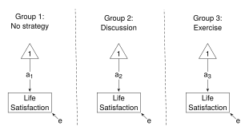

# One-Way ANOVA


Thompson, M., Lie, Y. & Green, S. (2023). Flexible structural equation
modeling approaches for analyzing means. In R. Hoyle (Ed.), *Handbook of
structural equation modeling* (2nd ed., pp. 385-408). New York, NY:
Guilford Press.

<br />

Thompson, Liu & Green (TLG) show an ordinary least squares (OLS)
regression approach and a structural equation modeling (SEM) approach
to:

1.  One-way ANOVA
2.  One-way ANCOVA
3.  Two-way ANOVA
4.  One-way MANOVA
5.  One-way ANOVA of a latent variable

This example shows the SEM approach to Part 1: One-way ANOVA. Results
are reported in Table 21.1 (p. 389). For a regression approach, see the
`Regressions` folder.

The data (`satisfactionI.csv` in the `data` folder) are described at the
top of page 388. The data file needs manipulation before it can be used:
the format needs to be changed from “long” to “wide”. These
manipulations are completed in `ANOVA_data.r`.

<br />

#### Load relevant packages and get the data

Load the **lavaan** package (and the **here** package), and run
`ANOVA_data.r` to get the data. The data will be in the `df` data frame.

``` r
library(lavaan)
library(here)         # Relative paths

path <- here::here("Green_2023", "data", "ANOVA_data.r")
source(path)
head(df)
```

The variables used in this example are:

- x - Coping Strategy (“a” - no strategy; “b” - discussion; “c” -
  exercise)
- y - dependent variable (“after” self-satisfaction scores)

<br />

### Structural Equation Modeling using **lavaan**

The SEM model for one-way ANOVA is shown in Fig 21.1 (p. 391), and is
reproduced below. The diagram shows the “Less Constrained” model - the
three means, represented by the label on the arrows connecting the “1”
to the dependent variable, differ. To be consistent with the ANOVA
assumption of homogeneity of variances, the residual variances are
constrained to be equal.



Two models are fitted. The model statements are shown below. The “More
Constrained” model constrains the means (each with the same label “a”)
to equality. The “Less Constrained” model allows the means (represented
by the labels “a1”, “a2”, and “a3”) to differ across the groups.
(Alternatively, this line could have been writted as `y ~ 1`; that is,
with no label, the means are freely estimated in each group. I leave the
labels in to be consistent with the diagram of the model.) In both
models the residual variances (each with the same label “e”) are
constrained to equality.

In what follows, I use lists. The model statements are placed into a
list, then I use the `lapply()` or `sapply()` function to perform
operations on each element in the list (such as `sem()` to run the
analyses, or `summary()` to return summaries of the analyses, or `[[` to
extract elements); and I use the `Reduce()` function when I need to
perform operations across the two models (such as `anova()` to constrast
the fit of the two models).

``` r
models <- list(
  "More Constrained" =
    "y ~ c(a, a, a)*1      # Means
     y ~~ c(e, e, e)*y     # Variances",

  "Less Constrained" =
    "y ~ c(a1, a2, a3)*1
     y ~~ c(e, e, e)*y"
)
```

<br />

#### Fit the models and get the results

The `lapply()` function applies the `sem()` function to the two elements
of the `models` list (with `data` set to `df`, and `group` set to the
`"x"` variable).

``` r
fit <- lapply(models, sem, data = df, group = "x")

lapply(fit, summary)
```

The “SEM” sections of Table 21.1 show the means, pooled error variances,
and the $\upchi$<sup>2</sup> test.

The summaries show “Intercepts” (that is, the estimated means) and
“Variances” (that is, the error variances) for each “Coping Strategy”
group for both models. Compare with means and pooled error variances in
the SEM section in Table 21.1.

Rather than, or perhaps, as well as, searching through the model
summaries for the means and variances, they can be extracted from a list
of estimates of model parameters.

``` r
# Get list of estimates
estimates <- lapply(fit, lavInspect, "est"); estimates

# Extract means - in element "nu"
means <- list()
for (i in names(models)) {
   means[[i]] <- estimates[[i]] |>
      sapply("[[", "nu")
}
means <- do.call(cbind, means); means

# Extract error variances - in element "theta"
ErrorVar <- list()
for (i in names(models)) {
   ErrorVar[[i]] <- estimates[[i]] |>
      sapply("[[", "theta")
}
ErrorVar <- do.call(cbind, ErrorVar); ErrorVar
```

To perform the $\upchi$<sup>2</sup> test (to compare the fit of the two
models), apply the `anova()` function to the two models.

``` r
Reduce(anova, fit)
```

Compare with the $\upchi$<sup>2</sup> statistic and p value in Table
21.1.

On page 390, TLG give model fit statistics for both models. These are
available in the anova output above, or they can be extracted separately
from the list of fit measures. First, a function to extract the
$\upchi$<sup>2</sup> statistic, degrees of freedom, and the p value,
then that function is applied to both models.

``` r
GetFit <- function(fit) {
   tab <- fitMeasures(fit, c("chisq", "df", "pvalue"))
   tab <- round(tab, 3) 
   return(tab)
}

sapply(fit, GetFit)
```

Note: Neither model fits well.

TLG mention the calculation for R<sup>2</sup> (p. 390). The relevant
SSEs can be obtained from the error variances (see `ErrorVar`) by
multiplying error variance by sample size. However, note that
multiplication is not needed because sample size will cancel out; that
is, substitute the error variances into Equation 21.4.

``` r
Rsquare <- ErrorVar["a", ] |>
   Reduce(function(mc, lc) (mc - lc)/mc, x = _)  # Substitute into Eq 21.4  
Rsquare
```

<br />

#### Relaxing assumption of homogeneity of variances

TLG do not run these models though they make reference to them. The
model statements when the homogeneity of variances assumption is relaxed
are shown below.

``` r
models <- list(
  "More Constrained" = 
    "y ~ c(a, a, a)*1          # Means
     y ~~ c(e1, e2, e3)*y      # Variances",

  "Less Constrained" = 
    "y ~ c(a1, a2, a3)*1
     y ~~ c(e1, e2, e3)*y"
)
```

Run the models and get the summaries. In this analysis I use the “mlm”
estimator, a robust ML estimator; that is, the normality assumption is
relaxed also.

``` r
fit <- lapply(models, sem, data = df, group = "x", estimator = "mlm")
lapply(fit, summary)
```

This time, the “Less Constrained” model is just identified - a perfect
fit.

<br />

The R script with minimal commenting is available in
[01_one_way_ANOVA.r](01_one_way_ANOVA.r).
