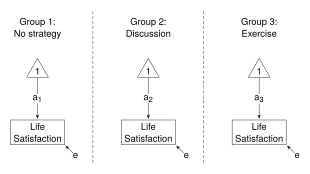
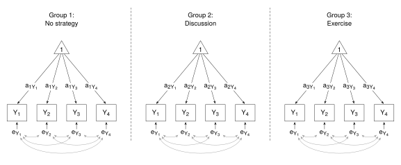
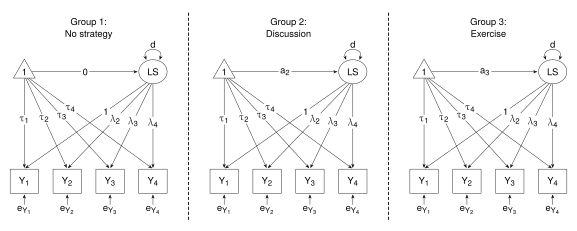

# One-Way ANOVA of latent variable


Thompson, M., Liu, Y. & Green, S. (2023). Flexible structural equation
modeling approaches for analyzing means. In R. Hoyle (Ed.), *Handbook of
structural equation modeling* (2nd ed., pp. 385-408). New York, NY:
Guilford Press.

Thompson, Liu & Green (TLG) show an ordinary least squares (OLS)
regression approach and a structural equation modeling (SEM) approach
to:

1.  One-way ANOVA
2.  One-way ANCOVA
3.  Two-way ANOVA
4.  One-way MANOVA
5.  One-way ANOVA of a latent variable

This example shows the SEM approach to Part 1: One-way ANOVA. Results
are reported in Table 21.1 (p. 389).

The data are described at the top of page 388. TLG claim that the data
are available in supplementary materials but I’m unable to locate it.
However, the data are available in Mplus data files in supplementary
materials for the 1st edition. I’ve collected the data into a more
convenient format (see the next section for getting the data), but it is
in a “long” format. It needs to be rearranged from “long” to “wide”.

#### Load package and get the data

Load the **lavaan** package, and run `satisfactionI.r` and
`ANOVA_data.r` to get and rearrange the data (`satisfactionI.r` and
`ANOVA_data.r` are available at the end of this post). The data will be
in the `df` data frame.

``` r
library(lavaan)

source("satisfactionI.r")
head(df)

source("ANOVA_data.r")
head(df)
```

The variables used in this example are:

- x - Coping Strategy (“a” - no strategy; “b” - discussion; “c” -
  exercise)
- y - dependent variable (“after” Life-Satisfaction scores)

#### The models

The SEM path diagram for a one-way ANOVA is shown in Fig 21.1 (p. 391),
and is reproduced below. The diagram shows the “Less Constrained”
model - the three means, represented by the labels on the arrows
connecting the “1” to the dependent variable, differ. To be consistent
with the ANOVA assumption of homogeneity of variances, the residual
variances are constrained to be equal.



Two models are fitted. The model statements are shown below. The “More
Constrained” model constrains the means (each with the same label “a”)
to equality. The “Less Constrained” model allows the means (represented
by the labels “a1”, “a2”, and “a3”) to differ across the groups.
(Alternatively, this line could have been written as `y ~ 1`; that is,
with no label, the means are freely estimated in each group. I leave the
labels in to be consistent with the diagram of the model.) In both
models the residual variances (each with the same label “e”) are
constrained to equality.

In what follows, I use lists. The model statements are placed into a
list, then I use the `lapply()` or `sapply()` function to perform
operations on each element in the list (such as `sem()` to run the
analyses, or `summary()` to return summaries of the analyses, or `[[` to
extract elements); and I use the `Reduce()` function when I need to
perform operations across the two models (such as `anova()` to constrast
the fit of the two models).

``` r
models <- list(
  "More Constrained" =
    "y ~  c(a, a, a)*1     # Means
     y ~~ c(e, e, e)*y     # Variances",

  "Less Constrained" =
    "y ~  c(a1, a2, a3)*1
     y ~~ c(e, e, e)*y"
)
```

#### Fit the models and get the results

The `lapply()` function applies the `sem()` function to the two elements
of the `models` list (with `data` set to `df`, and `group` set to the
`"x"` variable).

``` r
fit <- lapply(models, sem, data = df, group = "x")

lapply(fit, summary)
```

The “SEM” sections of Table 21.1 show the means, pooled error variances,
and the $\upchi$<sup>2</sup> test.

The summaries show “Intercepts” (that is, the estimated means) and
“Variances” (that is, the error variances) for each “Coping Strategy”
group for both models. Compare with means and pooled error variances in
the SEM section in Table 21.1.

Rather than, or perhaps, as well as, searching through the model
summaries for the means and variances, they can be extracted from a list
of estimates of model parameters.

``` r
## Get list of estimates
estimates <- lapply(fit, lavInspect, "est"); estimates

## Extract means - in element "nu"
means <- list()
for (i in names(models)) {
   means[[i]] <- estimates[[i]] |>
      sapply("[[", "nu")
}
means <- do.call(cbind, means); means

## Extract error variances - in element "theta"
ErrorVar <- list()
for (i in names(models)) {
   ErrorVar[[i]] <- estimates[[i]] |>
      sapply("[[", "theta")
}
ErrorVar <- do.call(cbind, ErrorVar); ErrorVar
```

To perform the $\upchi$<sup>2</sup> test (to compare the fit of the two
models), apply the `anova()` function to the two models.

``` r
Reduce(anova, fit)
```

Compare with the $\upchi$<sup>2</sup> statistic and p value in Table
21.1.

On page 390, TLG give model fit statistics for both models. These are
available in the anova output above, or they can be extracted separately
from the list of fit measures. First, a function to extract the
$\upchi$<sup>2</sup> statistic, degrees of freedom, and the p value,
then that function is applied to both models.

``` r
GetFit <- function(fit) {
   tab <- fitMeasures(fit, c("chisq", "df", "pvalue"))
   tab <- round(tab, 3)
   return(tab)
}

sapply(fit, GetFit)
```

Note: Neither model fits well.

TLG mention the calculation for R<sup>2</sup> (p. 390). The relevant
SSEs can be obtained from the error variances (see `ErrorVar`) by
multiplying error variance by sample size. However, note that
multiplication is not needed because sample size will cancel out; that
is, substitute the error variances into Equation 21.4.

``` r
Rsquare <- ErrorVar["a", ] |>
   Reduce(function(mc, lc) (mc - lc)/mc, x = _)  # Substitute into Eq 21.4
Rsquare
```

#### Relaxing assumption of homogeneity of variances

TLG do not run these models though they make reference to them. The
model statements when the homogeneity of variances assumption is relaxed
are shown below.

``` r
models <- list(
  "More Constrained" =
    "y ~  c(a, a, a)*1         # Means
     y ~~ c(e1, e2, e3)*y      # Variances",

  "Less Constrained" =
    "y ~  c(a1, a2, a3)*1
     y ~~ c(e1, e2, e3)*y"
)
```

Run the models and get the summaries. In this analysis I use the “mlm”
estimator, a robust ML estimator; that is, the normality assumption is
relaxed also.

``` r
fit <- lapply(models, sem, data = df, group = "x", estimator = "mlm")
lapply(fit, summary)
```

This time, the “Less Constrained” model is just identified - a perfect
fit.

<br />

<details class="code-fold">
<summary>R code with minimal commenting</summary>

``` r
## One-way ANOVA
##
## Thompson, M., Liu, Y. & Green, S. (2023). Flexible structural equation modeling
## approaches for analyzing means. In R. Hoyle (Ed.), Handbook of structural
## equation modeling (2nd ed., pp. 385-408). New York, NY: Guilford Press.

## Load package
library(lavaan)

## Get the data
source("satisfactionI.r")
head(df)

## Rearrange the data file
source("ANOVA_data.r")
head(df)

## The models
models <- list(
  "More Constrained" =
    "y ~  c(a, a, a)*1     # Means
     y ~~ c(e, e, e)*y     # Variances",

  "Less Constrained" =
    "y ~  c(a1, a2, a3)*1
     y ~~ c(e, e, e)*y"
)

## Fit the models
fit <- lapply(models, sem, data = df, group = "x")

## Get model summaries
## Check results with "SEM" section of Table 21.1
lapply(fit, summary)

## Extract means and variances from list of estimates
## Get list of estimates
estimates <- lapply(fit, lavInspect, "est"); estimates

## Extract means - in element "nu"
means <- list()
for (i in names(models)) {
   means[[i]] <- estimates[[i]] |>
      sapply("[[", "nu")
}
means <- do.call(cbind, means); means

## Extract error variances - in element "theta"
ErrorVar <- list()
for (i in names(models)) {
   ErrorVar[[i]] <- estimates[[i]] |>
      sapply("[[", "theta")
}
ErrorVar <- do.call(cbind, ErrorVar); ErrorVar

## Contrast model fits
## Check with chi sq statistic and p value in Table 21.1
Reduce(anova, fit)

## Fit for each model - Chi squares
## Check with values on page 390
## First, a function to extract chi squares
GetFit <- function(fit) {
   tab <- fitMeasures(fit, c("chisq", "df", "pvalue"))
   tab <- round(tab, 3)
   return(tab)
}

sapply(fit, GetFit)

## R square
## Check with Equation 21.4
Rsquare <- ErrorVar["a", ] |>
   Reduce(function(mc, lc) (mc - lc)/mc, x = _)  # Substitute into Eq 21.4
Rsquare

## Relax homogeneity of variances assumption
models <- list(
  "More Constrained" =
    "y ~  c(a, a, a)*1         # Means
     y ~~ c(e1, e2, e3)*y      # Variances",

  "Less Constrained" =
    "y ~  c(a1, a2, a3)*1
     y ~~ c(e1, e2, e3)*y"
)

## Run the model and get the summary
fit <- lapply(models, sem, data = df, group = "x", estimator = "mlm")
lapply(fit, summary)
```

</details>

<details class="code-fold">
<summary>R code to get data file - `satisfactionI.r`</summary>

``` r
### Data for Tables 21.1, 21.2, 21.3, 21.4 ###

df <- structure(list(x = c("a", "a", "a", "a", "a", "a", "a", "a", 
"a", "a", "a", "a", "a", "a", "a", "a", "a", "a", "b", "b", "b", 
"b", "b", "b", "b", "b", "b", "b", "b", "b", "c", "c", "c", "c", 
"c", "c", "c", "c", "c", "c", "c", "c", "c", "c", "c", "c", "c", 
"c"), g = c("m", "m", "m", "m", "m", "m", "f", "f", "f", "m", 
"m", "m", "m", "m", "m", "f", "f", "f", "m", "m", "m", "f", "f", 
"f", "m", "m", "m", "f", "f", "f", "m", "m", "m", "f", "f", "f", 
"f", "f", "f", "m", "m", "m", "f", "f", "f", "f", "f", "f"), 
    c = c("before", "before", "before", "before", "before", "before", 
    "before", "before", "before", "after", "after", "after", 
    "after", "after", "after", "after", "after", "after", "before", 
    "before", "before", "before", "before", "before", "after", 
    "after", "after", "after", "after", "after", "before", "before", 
    "before", "before", "before", "before", "before", "before", 
    "before", "after", "after", "after", "after", "after", "after", 
    "after", "after", "after"), y = c(21, 19, 22, 21, 24, 23, 
    21, 24, 23, 22, 22, 24, 25, 27, 30, 22, 23, 24, 23, 23, 21, 
    19, 22, 21, 30, 26, 22, 25, 26, 27, 27, 25, 24, 25, 23, 22, 
    23, 28, 26, 34, 30, 26, 26, 27, 28, 29, 40, 42)), class = "data.frame", row.names = c(NA, 
-48L))


head(df)

## x - Coping Strategy (a - No strategy; b - Discussion; c - Exercise)
## g - Gender
## c - before/after 
## y - dependent variable (Life Satisfaction)
```

</details>

<details class="code-fold">
<summary>R code to rearrange data file - `ANOVA_data.r`</summary>

``` r
### Data for Tables 21.1, 21.2, 21.3, 21.4 ###

## Reshape data - long to wide
tab <- 0.5 * table(df$x)  # in each condition
df$id <- c(rep(1:tab[1], 2), rep(1:tab[2], 2), rep(1:tab[3], 2))  # id variable 

df <- reshape(df, timevar = "c", idvar = c("id", "x", "g"), varying = c("pre", "y"), 
   direction = "wide")

df <- within(df, {
## Grand mean centered "pre" - the before scores
   preC <- scale(pre, scale = FALSE)

## Drop the id variable
   id <- NULL

## Gender X Coping Strategy interaction
  sg <- interaction(x, g, sep = "")

## Dummy variables to use in regression analysis
## Dummy variables for "Coping Startegy"
   dummies1 <- model.matrix(~ x - 1)

## Dummy variables for interaction
   dummies2 <- model.matrix(~ sg - 1)
})

## Unnest the nested 'dummies' matrices, and rename their colomns
df <- do.call(data.frame, df)
names(df) <- gsub("dummies1.x", "", names(df))
names(df) <- gsub("dummies2.sg", "", names(df))
```

</details>

`{r echo = FALSE} ## One-way ANCOVA ## ## Thompson, M., Liu, Y. & Green, S. (2023). Flexible structural equation modeling ## approaches for analyzing means. In R. Hoyle (Ed.), Handbook of structural ## equation modeling (2nd ed., pp. 385-408). New York, NY: Guilford Press.`

Thompson, M., Liu, Y. & Green, S. (2023). Flexible structural equation
modeling approaches for analyzing means. In R. Hoyle (Ed.), *Handbook of
structural equation modeling* (2nd ed., pp. 385-408). New York, NY:
Guilford Press.

This example shows the SEM approach to Part 2: One-way ANCOVA. Results
are reported in Table 21.2 (p. 393).

The data file needs rearranging before it can be used: the format needs
to be changed from “long” to “wide”, and the pre or before Life
Satisfaction scores need to be centered.

#### Load package and get the data

Load the **lavaan** packages, and run `satisfactionI.r` and
`ANOVA_data.r` to get and rearrange the data.

\`\`\`{r echo = c(-8, -4, -1)} \## Load package library(lavaan)

## Get the data

source(“satisfactionI.r”) head(df)

## Rearrange the data file

source(“ANOVA_data.r”) head(df)


    The variables used in this example are:

     - x - Coping Strategy ("a" - no strategy; "b" - discussion; "c" - exercise)
     - y - dependent variable ("after" Life-Satisfaction scores)
     - preC - pre-Life-Satisfaction scores grand mean centered

    The steps are the same as with the one_way_ANOVA. The only difference is the addition of the covariate, preC.


    #### The models

    The SEM path diagram for a one-way ANCOVA is shown below. The diagram shows the "Less Constrained" model - the three means, represented by the labels on the arrows connecting the "1" to the dependent variable, differ. To be consistent with the ANCOVA assumptions of homogeneity of variances and homogeneity of regression slopes, the residual variances and the coefficients for the covariate (preC) are each constrained to equality.

    {fig-align="center"}

    The model statements are shown below. The "More Constrained" model constrains the means to equality. The "Less Constrained" model allows the means to differ across the groups. In both cases the residual variances and the coefficients for the covariate are constrained to equality.

    ```{r echo = -1}
    ## The models
    models <- list(
      "More Constrained" =
        "y ~  c(a, a, a)*1        # Means
         y ~  c(b, b, b)*preC     # Regression slopes
         y ~~ c(e, e, e)*y        # Variances",

      "Less Constrained" =
        "y ~  c(a1, a2, a3)*1
         y ~  c(b, b, b)*preC
         y ~~ c(e, e, e)*y"
    )

#### Fit the models and get the results

The `lapply()` function applies the `sem()` function to the two elements
of the `models` list (with `data` set to `df`, and `group` set to the
`"x"` variable).

\`\`\`{r echo = c(-5:-4, -1)} \## Fit the models fit \<- lapply(models,
sem, data = df, group = “x”)

## Get model summaries

## Check results with “SEM” section of Table 21.2

lapply(fit, summary)


    The "SEM" sections of Table 21.2 show the means, pooled error variances, and the $\upchi$^2^ test; the footnote to Table 21.2 gives the regression coefficients.

    Scroll through the summaries to find the "Intercepts", "Variances", and "Regressions"; or extract them from the list of estimates of model parameters.

    ```{r echo = c(-1)}
    ## Extract means, variances, and regression coefficients from list of estimates
    ## Get list of estimates
    estimates <- lapply(fit, lavInspect, "est"); estimates

    ## Extract means - in element "alpha"
    means <- list()
    for (i in names(models)){
       means[[i]] <- estimates[[i]] |>
          lapply("[[", "alpha") |>       # Means for Y and preC
          sapply("[[", 1)                # Means for Y
    }
    means <- do.call(cbind, means); means

    ## Extract error variances -  in element "psi"
    ErrorVar <- list()
    for (i in names(models)){
       ErrorVar[[i]] <- estimates[[i]] |>
          lapply("[[", "psi")  |>        # Extract "psi" element
          sapply("[[", 1, 1)             # 1st row, 1st column of "psi"
    }
    ErrorVar <- do.call(cbind, ErrorVar); ErrorVar

    ## Extract regression coefficients -  in element "beta"
    RegCoef <- list()
    for (i in names(models)){
       RegCoef[[i]] <- estimates[[i]] |>
          lapply("[[", "beta")  |>       # Extract "beta" element
          sapply("[[", 1, 2)             # 1st row, 2nd column of "beta"
    }
    RegCoef <- do.call(cbind, RegCoef); RegCoef

To perform the $\upchi$<sup>2</sup> test (to compare the fit of the two
models), apply the `anova()` function to the two models.

`{r echo = -2:-1} ## Contrast model fits ## Check with chi sq statistic and p value in Table 21.2 Reduce(anova, fit)`

Compare with the $\upchi$<sup>2</sup> statistic and p value in Table
21.2.

In Equation 21.9 (p. 394), Thompson, Lie & Green give calculations for
R<sup>2</sup>. As was the case with the one-way ANOVA, the relevant SSEs
can be obtained from the error variances (see `ErrorVar`) by multiplying
error variance by sample size. But again, the multiplication is not
needed because sample size will cancel out; that is, substitute the
error variances into Equation 21.9.

`{r echo = -2:-1} ## R square ## Check with Equation 21.9 Rsquare <- ErrorVar["a", ] |>    Reduce(function(mc, lc) (mc - lc)/mc, x = _)  # Substitute into Eq 21.9 Rsquare`

<br />

``` {r}
#| echo: false
#| include: false
#| eval: true
#| purl: false
input <- knitr::current_input()
output <- "R/one_way_ANCOVA.r"
knitr::purl(input, output, documentation = 0, quiet = TRUE)
xfun::gsub_file(output, "^# NA", "")
xfun::gsub_file(output, "^# ", "")
```

``` {r}
#| echo: true
#| code-fold: true
#| code-summary: "R code with minimal commenting"
#| file: !expr "noquote(output)"
```

``` {r}
#| echo: true
#| code-fold: true
#| code-summary: "R code to get data file - `satisfactionI.r`"
#| file: "R/satisfactionI.r"
```

``` {r}
#| echo: true
#| code-fold: true
#| code-summary: "R code to rearrange data file - `ANOVA_data.r`"
#| file: "R/ANOVA_data.r"
```

<style>
.math.display .MathJax {
  font-size: 95% !important;
}
</style>

`{r echo = FALSE} ## Two-way ANOVA ## ## Thompson, M., Liu, Y. & Green, S. (2023). Flexible  structural equation modeling ## approaches for analyzing means. In R. Hoyle (Ed.), Handbook of structural ## equation modeling (2nd ed., pp. 385-408). New York, NY: Guilford Press.`

Thompson, M., Liu, Y. & Green, S. (2023). Flexible structural equation
modeling approaches for analyzing means. In R. Hoyle (Ed.), *Handbook of
structural equation modeling* (2nd ed., pp. 385-408). New York, NY:
Guilford Press.

This example shows the SEM approach to Part 3: Two-way ANOVA. Results
are reported in Tables 21.3 and 21.4 (pp. 395, 396).

The data file needs rearranging before it can be used: the format needs
to be changed from “long” to “wide”, and the Gender X Coping Strategy
interaction needs a grouping variable set up.

#### Load packages and get the data

Load the relevant packages, and run `satisfactionI.r` and `ANOVA_data.r`
to get and rearrange the data.

\`\`\`{r echo = c(-9, -5, -1)} \## Load packages library(lavaan)
library(DescTools) \# Cramer’s V

## Get the data

source(“satisfactionI.r”) head(df)

## Rearrange the data file

source(“ANOVA_data.r”) head(df)


    The variables used in this example are:

     - x - Coping Strategy ("a" - no strategy; "b" - discussion; "c" - exercise)
     - g - Gender
     - y - dependent variable ("after" Life-Satisfaction scores)
     - sg - Gender X Coping Strategy interaction


    #### Preliminary results - Cramer's V

    On page 394, Thompson, Liu & Green give Cramer's V for the Gender X Coping Strategy crosstabulation. As far as I know, Cramer's V is not available in base R, but **DescTools** is one of possibly many packages that has a function for Cramer's V.

    ```{r echo = -2:-1}
    ## Cramer's V
    ## Check with page 394
    DescTools::CramerV(df$g, df$x)

However, it is easy to calculate Cramer’s V without the need for the
extra package, given the formula:

$$
 \mathsf{Cramer's ~ V} = \sqrt{\frac{\upchi^2 / n}{\min(r-1, ~ c-1)}}
$$

where $n$ is the sample size, $r$ is the number of rows, and $c$ is the
number of columns.

\`\`\`{r echo = -1} \## Cramer’s V by hand chisq \<-
unname(chisq.test(df$g, df$x)$statistic)
n <- nrow(df)               # Sample size
r <- length(unique(df$g)) \# Number of rows c \<- length(unique(df\$x))
\# Number of columns

CV \<- sqrt((chisq/n)/min(r-1, c-1)); CV


    Standardised residuals will give the direction of the relationship (p. 394).

    ```{r echo = -1}
    ## Direction of the relationship
    chisq.test(df$g, df$x)$stdres

#### Preliminary results - Gender X Coping Strategy crosstabulation

Table 21.3 (p. 395) gives the cell means and frequecies, and the
weighted and unweighted marginal means.

Get the cell means and frequencies.

`{r echo = -2:-1} ## Cell means and cell frequencies ## Check cell means and frequencies in Table 21.3 means <- with(df, tapply(y, list(g, x), mean)); means     # Cell means freq  <- with(df, table(g, x)); freq                      # Cell frequencies`

Get the unweighted and weighted marginal means.

\`\`\`{r echo = -1} \## Check unweighted and weighted means in Table
21.3 \# Unweighted marginal means apply(means, 1, mean) \# Gender
apply(means, 2, mean) \# Coping Strategy

# Weighted marginal means

with(df, tapply(y, g, mean)) \# Gender with(df, tapply(y, x, mean)) \#
Coping Strategy


    #### The models

    The SEM path diagram for a two-way ANOVA is shown below. The diagram shows the "Less Constrained" model - the six means, represented by the label on the arrows connecting the "1" to the dependent variable, differ. To be consistent with the ANOVA assumption of homogeneity of variances, the residual variances are constrained to be equal.

    {fig-align="center"}

    The model statements are shown below. The "Less Constrained" model allows the means (represented by the labels, am, af, ..., cf) to differ across the groups. The constraints statements are added to the "Less Constrained" statement to give the "More Constrained" models. The "More Constrained" models are contrasted with the "Less Constrained" model to test for the Gender and Coping Strategy main effects (weighted and unweighted) and the Gender X Coping Strategy interaction. In each case the residual variances are constrained to equality.

    Constraint for the unweighted Gender main effect - Restrict the mean for males to equal the mean for females. But there are three means for females, one for each Coping Strategy group. Similarly, there are three means for males. Simply constrain the sum of the three means for males to equal the sum of the three means for females.

    Constraints for the unweighted Coping Strategy main effect - Restrict the mean for "a" strategy to equal the mean for "b" strategy to equal the mean for "c" strategy. That is, constrain the sum of the two "a" means to equal the sum of the two "b" means; and the sum of the two "b" means to equal the sum of the two "c" means.

    To test for the main effects applied to weighted means, the constraints are set the same way as before except the means are weighted in proportion to the cell frequencies.

    Constraints for the Gender X Coping Strategy interaction - The "More Constrained" model needs the means to be constrained so that the difference between the mean for "female" and the mean for "male" remains constant across levels of "Coping Strategy". That is: the difference between "female" mean and "male" mean for the "a" strategy equals the difference between "female" mean and "male" mean for the "b" strategy; and the difference between "female" mean and "male" mean for the "b" strategy equals the difference between "female" mean and "male" mean for the "c" strategy.


    ```{r}
    ## Less Constrained model
    lc <- "y ~  c(am, af, bm, bf, cm, cf)*1      # Means
           y ~~ c(e, e, e, e, e, e)*y            # Variances"

    lc.fit <- sem(lc, data = df, group = "sg")
    summary(lc.fit)

    ## Gender main effect - unweighted means
    constraints <- "af + bf + cf == am + bm + cm"
    gend_unw <- c(lc, constraints)

    gend_unw.fit <- sem(gend_unw, data = df, group = "sg")
    summary(gend_unw.fit)

    anova(gend_unw.fit, lc.fit)   # Compare the two models

    ## Coping Strategy main effect - unweighted means
    constraints <- 
      "af + am == bf + bm 
       af + am == cf + cm"
    strat_unw <- c(lc, constraints)

    strat_unw.fit <- sem(strat_unw, data = df, group = "sg")
    summary(strat_unw.fit)

    anova(strat_unw.fit, lc.fit)   # Compare the two models

    ## Gender main effect - weighted means
    freq                     # To assist with constructing constraints
    constraints <- "(3*af + 3*bf + 6*cf)/12 == (6*am + 3*bm + 3*cm)/12"
    gend_w <- c(lc, constraints)

    gend_w.fit <- sem(gend_w, data = df, group = "sg")
    summary(gend_w.fit)

    anova(gend_w.fit, lc.fit)   # Compare the two models

    ## Coping Strategy main effect - weighted means
    ## Compare with SEM section in Table 21.4
    freq
    constraints <- 
      "(3*af + 6*am)/9 == (3*bf + 3*bm)/6 
       (3*bf + 3*bm)/6 == (6*cf + 3*cm)/9"
    strat_w <- c(lc, constraints)

    strat_w.fit <- sem(strat_w, data = df, group = "sg")
    summary(strat_w.fit)

    anova(strat_w.fit, lc.fit)   # Compare the two models

    ## Gender X Coping Strategy interaction
    constraints <- 
      "(af - am) == (bf - bm)
       (bf - bm) == (cf - cm)"
    inter <- c(lc, constraints)

    inter.fit <- sem(inter, data = df, group = "sg")
    summary(inter.fit)

    anova(inter.fit, lc.fit)     # Compare the two models

<br />

``` {r}
#| echo: false
#| include: false
#| eval: true
#| purl: false
input <- knitr::current_input()
output <- "R/two_way_ANOVA.r"
knitr::purl(input, output, documentation = 0, quiet = TRUE)
xfun::gsub_file(output, "^# NA", "")
xfun::gsub_file(output, "^# ", "")
```

``` {r}
#| echo: true
#| code-fold: true
#| code-summary: "R code with minimal commenting"
#| file: !expr "noquote(output)"
```

``` {r}
#| echo: true
#| code-fold: true
#| code-summary: "R code to get data file - `satisfactionI.r`"
#| file: "R/satisfactionI.r"
```

``` {r}
#| echo: true
#| code-fold: true
#| code-summary: "R code to rearrange data file - `ANOVA_data.r`"
#| file: "R/ANOVA_data.r"
```

`{r echo = FALSE} ## One-way MANOVA ## ## Thompson, M., Liu, Y. & Green, S. (2023). Flexible structural equation modeling ## approaches for analyzing means. In R. Hoyle (Ed.), Handbook of structural ## equation modeling (2nd ed., pp. 385-408). New York, NY: Guilford Press.`

Thompson, M., Liu, Y. & Green, S. (2023). Flexible structural equation
modeling approaches for analyzing means. In R. Hoyle (Ed.), *Handbook of
structural equation modeling* (2nd ed., pp. 385-408). New York, NY:
Guilford Press.

This example shows the SEM approach to Part 4: One-way MANOVA. Results
are reported in Table 21.5 (p. 399).

The data are described on pages 397 and 398.

#### Load package and get the data

Load the **lavaan** package, and run `satisfactionII.r` to get the data
(`satisfactionII.r` is available at the end of this post).

\`\`\`{r echo = c(-4, -1)} \## Load package library(lavaan)

## Get the data

source(“satisfactionII.r”) head(df)


    The variables used in this example are:

     - x - Coping Strategy ("a" - no strategy; "b" - discussion; "c" - exercise)
     - y1, y2, y3, y4 - Multiple dependent variables (Life-Satisfaction scores)


    #### The models

    The SEM path diagram for the a one-way MANOVA is shown in Fig 21.2 (p. 400), and is reproduced below. The diagram shows the "Less Constrained" model. The means are represented by the labels on the arrows connecting the "1" to the dependent variables. The means for each variable are allowed to differ across the groups. The residual variances and covariances are constrained to equality.

    {fig-align="center"}

    The model statements are shown below. The "More Constrained" model constrains the means to equality. The "Less Constrained" model allows the means to differ across the groups. In both cases the residual variances and covariances are constrained to equality. The variancs and covariances can be set up separately - see `vcov` below. Then, `vcov` is added back into each model. Saves a little typing.

    ```{r echo = c(-1)}
    ## The models
    # Variances and covariances (for both models)
    vcov <-
       "y1 ~~ c(e1, e1, e1)*y1
        y2 ~~ c(e2, e2, e2)*y2
        y3 ~~ c(e3, e3, e3)*y3
        y4 ~~ c(e4, e4, e4)*y4

        y1 ~~ c(e12, e12, e12)*y2
        y1 ~~ c(e13, e13, e13)*y3
        y1 ~~ c(e14, e14, e14)*y4
        y2 ~~ c(e23, e23, e23)*y3
        y2 ~~ c(e24, e24, e24)*y4
        y3 ~~ c(e34, e34, e34)*y4"

    models <- list(
      "More Constrained" = c(
        # Means
        "y1 ~ c(a1, a1, a1)*1
         y2 ~ c(a2, a2, a2)*1
         y3 ~ c(a3, a3, a3)*1
         y4 ~ c(a4, a4, a4)*1",
         vcov),

      "Less Constrained" =  c(
        # Means
        "y1 ~ c(a1, b1, c1)*1
         y2 ~ c(a2, b2, c2)*1
         y3 ~ c(a3, b3, c3)*1
         y4 ~ c(a4, b4, c4)*1",
         vcov)
    )

#### Fit the models and get the results

\`\`\`{r echo = -2:-1} \## Fit the models and get the results \## Check
means and chi square test in Table 21.5 \## Fit the models fit \<-
lapply(models, sem, data = df, group = “x”)

## Get model summaries

lapply(fit, summary)

## Contrast model fits

Reduce(anova, fit)


    The "SEM" section of Table 21.5 shows the $\upchi$^2^ test.

    Scroll through the summaries to find the "Intercepts", or extract them from the list of estimates of model parameter.

    ```{r echo = -1}
    ## Extract means from list of estimates
    ## Get list of estimates
    estimates <- lapply(fit, lavInspect, "est"); estimates

    ## Extract means - in element "nu"
    means <- list()
    for (i in names(models)) {
       means[[i]] = estimates[[i]] |>
          sapply("[[", "nu") |>
          round(2)
       row.names(means[[i]]) = c("Y1", "Y2", "Y3", "Y4")
    }
    means  # Typos among "Less Constrained" means in Table 21.5)

Compare with the means in Table 21.5.

By way of completeness, get the error SSCP matrices. (Thompson, Liu &
Green (TLG) state that, “the error SSCP matrices were perfectly
reproduced by multiplying the variances and covariances in the SEM
output by the total sample size” p. 398).

`{r echo = -1} ## Get the error SSCP matrices by hand # Note: In the list of estimates, co/variances are in element "theta" E <- estimates |>   lapply("[[", "a") |>           # Extract estimates for group "a"   lapply("[[", "theta") |>       # Extract "theta" element   lapply(matrix, nrow = 4) |>    # Get the full matrix   lapply("*", 200)               # Multiply by sample size E`

#### Relax homogeneity of variances and covariances assumption

Towards the end of the section headed “Avoiding OLS assumptions for
ANOVA/MANOVA designs using SEM” (pp. 398-401), TLG present the results
for models in which the assumptions of homogeneity and normality are
relaxed. That is, variances and covariances are not constrained to
equality, and a robust ML method of estimation (MLM) is employed. Again,
the variances and covariances are set up separately, then added back
into each model. This time, there are no labels for the variances and
covariances, meaning that **lavaan** will estimate each variance and
covariance for each group.

\`\`\`{r echo = c(-2:-1)} \## Relax homogeneity of variances and
covariances assumption \## Check chi square on page 401 \## Model
statements \# Variances and covariances (for both models) vcov \<- “y1
\~~ y1 + y2 + y3 + y4 y2 \~~ y2 + y3 + y4 y3 \~~ y3 + y4 y4 \~~ y4”

models \<- list( “Less Constrained” = c( \# Means “y1 ~ c(a1, b1, c1)*1
y2 ~ c(a2, b2, c2)*1 y3 ~ c(a3, b3, c3)*1 y4 ~ c(a4, b4, c4)*1”, vcov),

“More Constrained” = c( \# Means “y1 ~ c(a1, a1, a1)*1 y2 ~ c(a2, a2,
a2)*1 y3 ~ c(a3, a3, a3)*1 y4 ~ c(a4, a4, a4)*1”, vcov) )

## Fit the models

fit \<- lapply(models, sem, data = df, estimator = “mlm”, group = “x”)

## Get model summaries

lapply(fit, summary)

## Contrast model fits

Reduce(anova, fit)


    Compare with the $\upchi$^2^ test on page 401.

    <br />

    ```{r}
    #| echo: false
    #| include: false
    #| eval: true
    #| purl: false
    input <- knitr::current_input()
    output <- "R/one_way_MANOVA.r"
    knitr::purl(input, output, documentation = 0, quiet = TRUE)
    xfun::gsub_file(output, "^# NA", "")
    xfun::gsub_file(output, "^# ", "")

``` {r}
#| echo: true
#| code-fold: true
#| code-summary: "R code with minimal commenting"
#| file: !expr "noquote(output)"
```

``` {r}
#| echo: true
#| code-fold: true
#| code-summary: "R code to get data file - `satisfactionII.r`"
#| file: "R/satisfactionII.r"
```

`{r echo = FALSE} ## One-way ANOVA of latent variable ## ## Thompson, M., Liu, Y. & Green, S. (2023). Flexible structural equation modeling ## approaches for analyzing means. In R. Hoyle (Ed.), Handbook of structural ## equation modeling (2nd ed., pp. 385-408). New York, NY: Guilford Press.`

Thompson, M., Liu, Y. & Green, S. (2023). Flexible structural equation
modeling approaches for analyzing means. In R. Hoyle (Ed.), *Handbook of
structural equation modeling* (2nd ed., pp. 385-408). New York, NY:
Guilford Press.

This example shows the SEM approach to Part 5: One-way ANOVA of a latent
variable. Results are reported in Table 21.6 (p. 404).

Any comparison of latent means assumes some level of measurement
invariance. The first part of this example demonstrates SEM assuming
strict measurement invariance. The second part demonstrates SEM under
partial invariance of loadings and intercepts.

#### Load package and get the data

Load the **lavaan** package, and run `satisfactionII.r` to get the data.

\`\`\`{r echo = c(-4, -1)} \## Load package library(lavaan)

## Get the data

source(“satisfactionII.r”) head(df)


    The variables used in this example are:

    - x - Coping Strategy ("a" - no strategy; "b" - discussion; "c" - exercise)
    - y1, y2, y3, y4 - Multiple dependent variables (Life-Satisfaction scores)


    #### The models

    The SEM path diagram for the a one-way ANOVA of a latent variable is shown in Fig 21.3 (p. 403), and is reproduced below. The diagram shows the "Less Constrained" model.

    {fig-align="center"}

    For purposes of identification and scaling, the loading for the first indicator is constrained to one. (Thompson, Liu & Green (TLG) claim that the loading for the 4th indicator is constrained to one. However, when the 4th loading is constrained to one, I do not get the same results as given in Table 21.6 (in particular the latent variance), nor do I get the means (given in the discussion on page 405); whereas I get agreement with the Table and the text when I constrain the 1st loading to one.)

    Also for the purposes of identification and scaling, the latent mean for the first group is constrained to zero. For the "Less Constrained" model, the latent means for the other groups (a2 and a3) are freely estimated.

    TLG assume strict measurement invariance:

    - the loadings ($\uplambda$) are constrained to equality across the groups;
    - the intercepts ($\uptau$) are constrained to equality across the groups;
    - the indicator residual variances (e) and covariances are constrained to equality (covariances are set to zero by default, and thus they are equal);
    - TLG impose one last constraint - latent error variances are constrained to equality across the groups (they do this to obtain a pooled variance to calculate an effect size for the differences between latent means).

    The model statements are shown below. The only difference between the "More Constrained" model and the "Less Constrained" model is in the latent means. For purposess of identification and scaling, the latent mean for the first group is constrained to zero; in the "More Constrained" model, in which the means are constrained to equality, all three are constrained to zero. In the "Less Constrained" model, the means in the second and third groups are freely estimated.

    The common parts of the two models are set up according to the bullet points above.

    ```{r echo = -1}
    ## The models
    common <- "
       #  Measurement model
       F =~ y1 + c(l2,l2,l2)*y2 + c(l3,l3,l3)*y3 + c(l4,l4,l4)*y4 

       # Indicator intercepts
       y1 ~ c(a1,a1,a1)*1
       y2 ~ c(a2,a2,a2)*1
       y3 ~ c(a3,a3,a3)*1
       y4 ~ c(a4,a4,a4)*1

       # Indicator residual variances
       y1 ~~ c(e1,e1,e1)*y1
       y2 ~~ c(e2,e2,e2)*y2
       y3 ~~ c(e3,e3,e3)*y3
       y4 ~~ c(e4,e4,e4)*y4

       # Latent error variances
       F ~~ c(d,d,d)*F"

    models <- list(
      "More Constrained" = c(
        "# Latent means
        F ~ c(m,m,m)*1

         # Constraint
         m == 0",

         common),

      "Less Constrained" =  c(
        "# Latent means
         F ~ c(m1,m2,m3)*1

         # Constraint
         m1 == 0",

        common)
    )

#### Fit the models and get the results

\`\`\`{r echo = -2:-1} \## Fit the models and get the results \## Check
results in “All measures” row in Table 21.6 \## Fit the models fit \<-
lapply(models, sem, data = df, group = “x”)

## Get model summaries

lapply(fit, summary)

## Contrast model fits

Reduce(anova, fit)


    Compare with $\upchi$^2^ test in the "All measures" row in Table 21.6.

    One could scroll through the model summaries to find the latent means and error variances for the "Less Constrained" model, and compare them with Table 21.6. They are also needed to calculate effect sizes (given in the first column on page 405).

    ```{r echo = -2:-1}
    ## Cut-and-paste means and variances to get effect sizes
    ## Compare with values given on page 405
    d1 <- (0.664 - 0) / sqrt(8.135); d1    # "no strategy" vs "discussion"
    d2 <- (1.945 - 0) / sqrt(8.135); d2    # "no strategy" vs "exercise"

But it is probably safer to extract latent means and error variances
from a list of parameter estimates, then substitute into the formula for
effect size.

\`\`\`{r echo = c(-11:-10, -2:-1)} \## Extract latent means and error
variances from “Less Constrained” model \## Check with “All measures”
row in Table 21.6 estimates \<- lavInspect(fit\[\[“Less
Constrained”\]\], “est”); estimates \# Note: latent means are in element
“alpha” \# latent error variances are in element “psi”

LatentMeans \<- sapply(estimates, “\[\[”, “alpha”); LatentMeans
LatentVar \<- sapply(estimates, “\[\[”, “psi”); LatentVar

## Effect sizes

## Compare with values given on page 405

\# “no strategy” vs “discussion” d1 \<- (LatentMeans\[2\] -
LatentMeans\[1\]) / sqrt(LatentVar\[1\]); d1

\# “no strategy” vs “exercise” d2 \<- (LatentMeans\[3\] -
LatentMeans\[1\]) / sqrt(LatentVar\[1\]); d2


    Compare the effect sizes with those given on page 405, and the means and error variances with those in Table 21.6.


    ### More Flexible Tests of Differences in Means on Latent Variables

    The second and third rows of Table 21.6 follow after a discussion in the section headed "More Flexible Tests of Differences in Means on Latent Variables" (pp. 406-407).

    In this section, TLG assume partial strong invariance:

    - Constrain the loading for one indicator to equality across groups
    - Constrain that indicator's intercept to equality across groups
    - The other loadings and intercepts are freely estimated

    For purposes of identification:

    - First loading in each group is constrained to one
    - Latent mean in the first group is constrained to zero

    Note that the residual variances are freely estimated across groups, as are the latent error variances. The indicator covariances are by default set to zero (unless there is good reason to have one or more estimated).

    For the "More Constrained" model, the latent means are constrained to equality across the groups; for the "Less Constrained" model, the latent means differ.

    The purpose of these examples is to demonstrate that "if a latent variable has only a single referent variable, the means and variances of the latent variable are a function of only the means and variances of this variable" (p. 406).


    #### Model that applies to the 2nd row in Table 21.6: "One measure - Y$_1$"

    The selected indicator is the first - "y1".

    ```{r echo = -2:-1}
    ## Relaxing some constraints
    ## ANOVA model for 2nd row in Table 21.6
    # Model statements
    common <- 
      "# Measurement model
       F =~ y1 + c(l12,l22,l32)*y2 + c(l13,l23,l33)*y3 + c(l14,l24,l34)*y4

       # Indicator intercepts
       y1 ~ c(a1,a1,a1)*1
       y2 ~ c(a12,a22,a32)*1
       y3 ~ c(a13,a23,a33)*1
       y4 ~ c(a14,a24,a34)*1

       # Indicator residual variances
       y1 ~~ c(e11,e21,e31)*y1
       y2 ~~ c(e12,e22,e32)*y2
       y3 ~~ c(e13,e23,e33)*y3
       y4 ~~ c(e14,e24,e34)*y4

       # Latent error variances
       F ~~ c(d1,d2,d3)*F"

    models <- list(
      "More Constrained" = c(
        "# Latent means
         F ~ c(m,m,m)*1

         # Constraint
         m == 0",
       
         common),

      "Less Constrained" =  c(
        "# Latent means
         F ~ c(m1,m2,m3)*1

         # Constraint
         m1 == 0",

         common)
    )

Fit the models and get the latent means, latent error variances, and the
$\upchi$<sup>2</sup> test.

\`\`\`{r echo = -2:-1} \## Fit the model and get the results \## Check
with means, error variance, and chi square in 2nd row in Table 21.6 \##
Fit the models fit \<- lapply(models, sem, data = df, group = “x”)

## Model summaries

lapply(fit, summary)

## Get the latent means and latent error variances for “Less Constrained” model

estimates \<- lavInspect(fit\[\[“Less Constrained”\]\], “est”);
estimates LatentMeans \<- sapply(estimates, “\[\[”, “alpha”);
LatentMeans LatentVar \<- sapply(estimates, “\[\[”, “psi”); LatentVar

## Contrast model fits

Reduce(anova, fit)


    Compare with the latent means and error variances, and the $\upchi$^2^ test in the 2nd row in Table 21.6.

    Consider the three columns of Table 21.6 dealing with means, variances and residual variances of one measure - in this case, "y1".

    I need sample means and covariances - they can be extract from a list of sample statistics. I need estimated indicator intercepts and residual variances - they can be extracted from `estimates`. Also I need estimated latent means and error variances - they have already been extracted.

    ```{r echo = -2:-1}
    ## Columns of Table 21.6 dealing with means, variances and residual variances of "y1"
    ## Need sample statistics and model estimates
    # Get sample statistics
    sampstat <- lavInspect(fit[["Less Constrained"]], "sampstat"); sampstat
       # Means are in element "mean"
       # Variances are the diagonal elements in element "cov"

    # Get estimated model parameters
    estimates
       # Residual variances for the measures are the diagonal elements in element "theta"
       # Intercepts for the measures are in element "nu"

##### Means of the measures for each group (ie, the “y1” means).

- Extract the “y1” means from `sampstats`
- Latent means already extracted in `LatentMeans`
- The differences between the “y1” means are the differences between the
  latent means  
- Alternatively, the “y1” intercepts (which are constrained to equality)
  when added to the latent means give the “y1” means

``` {r}
# Extract y1 means from sampstats
MeansY1 <- sapply(sampstat, "[[", "mean")
MeansY1 <- MeansY1[1,]; MeansY1   # Compare with 2nd row in Table 21.6

# Differences between y1 means are differencs between latent means
MeansY1[2] - MeansY1[1]
MeansY1[3] - MeansY1[1]

# Compare with latent means
LatentMeans

# Alternatively, the y1 intercepts (which are constrained to equality)
# added to the latent means give the y1 means
intercepts <- sapply(estimates, "[[", "nu")[1,1]; intercepts
intercepts + LatentMeans; MeansY1
```

##### Variances of the measure for each group (ie, “y1” variances)

- Extract the “y1” variances from `sampstats`
- Extract residual variances for “y1” from `estimates`
- Latent error variances already extracted in `LatentVar`
- Differences between “y1” variances and “y1” residual variances are the
  latent error variances

``` {r}
# Extract y1 variances from sampstats
VarY1 <- sapply(lapply(sampstat, "[[", "cov"), diag)
VarY1 <- VarY1[1,]; VarY1  # Compare with 2nd row in Table 21.6

# Extract residual variances for y1 from estimates
ResidVarY1 <- sapply(lapply(estimates, "[[", "theta"), diag)
ResidVarY1 <- ResidVarY1[1,]; ResidVarY1 # Compare with 2nd row in Table 21.6

# Differences between y1 variances and y1 residual variances are latent error variances
VarY1 - ResidVarY1

# Compare with the latent error variances
LatentVar
```

#### Model that applies to the 3rd row in Table 21.6: “One measure - Y$_2$”

The selected indicator is the second - “y2”.

This is the same as before, except the constraints on the loadings and
intercepts apply to the second indicator.

\`\`\`{r echo = -2:-1} \## Relaxing some constraints \## ANOVA model for
3rd row in Table 21.6 \# Model statements common \<- “# Measurement
model F =~ NA*c(l11,l21,l31)*y1 + 1*y2 + c(l13,l23,l33)*y3 +
c(l14,l24,l34)\*y4

\# Indicator intercepts y1 ~ c(a11,a21,a31)*1 y2 ~ c(a2,a2,a2)*1 y3 ~
c(a13,a23,a33)*1 y4 ~ c(a14,a24,a34)*1

\# Indicator residual variances y1 \~~ c(e11,e21,e31)*y1 y2 \~~
c(e12,e22,e32)*y2 y3 \~~ c(e13,e23,e33)*y3 y4 \~~ c(e14,e24,e34)*y4

\# Latent error variances F \~~ c(d1,d2,d3)\*F”

models \<- list( “Less Constrained” = c( “# Latent means F ~
c(m1,m2,m3)\*1

     # Constraint
     m1 == 0",

     common),

“More Constrained” = c( “# Latent means F ~ c(m,m,m)\*1

     # Constraint
     m == 0",

     common)

)


    Fit the models and get the latent means, latent error variances, and the $\upchi$^2^ test.

    ```{r echo = -2:-1}
    ## Fit the model and get the results
    ## Check with means, error variance, and chi square in 3rd row in Table 21.6
    # Fit the models
    fit <- lapply(models, sem, data = df, group = "x")

    # Model summaries
    lapply(fit, summary)

    # Get the latent means and latent error variances for "Less Constrained" model
    estimates <- lavInspect(fit[["Less Constrained"]], "est"); estimates
    LatentMeans <- sapply(estimates, "[[", "alpha"); LatentMeans
    LatentVar   <- sapply(estimates, "[[", "psi"); LatentVar

    # Contrast model fits
    Reduce(anova, fit)

Compare with the latent means and error variances, and the
$\upchi$<sup>2</sup> test in the 3rd row in Table 21.6.

Consider the three columns of Table 21.6 dealing with means, variances
and residual variances of one measure - in this case, “y2”.

I need sample means and covariances - they can be extract from a list of
sample statistics. I need estimated indicator intercepts and residual
variances - they can be extracted from `estimates`. Also I need
estimated latent means and error variances - they have already been
extracted.

\`\`\`{r echo = -2:-1} \## Columns of Table 21.6 dealing with means,
variances and residual variances of “y2” \## Need sample statistics and
model estimates \# Get sample statistics sampstat \<-
lavInspect(fit\[\[“Less Constrained”\]\], “sampstat”); sampstat \# Means
are in element “mean” \# Variances are the diagonal elements in element
“cov”

# Get estimated model parameters

estimates \# Residual variances for the measures are the diagonal
elements in element “theta” \# Intercepts for the measures are in
element “nu”


    ##### The means of the measures for each group (ie, the "y2" means).

    - Extract the "y2" means from `sampstats`
    - Latent means already extracted in `LatentMeans`
    - The differences between the "y2" means are the differences between the latent means
    - Alternatively, the "y2" intercepts (which are constrained to equality) when added to the latent means give the "y2" means

    ```{r}
    # Extract y2 Means from sampstats
    MeansY2 <- sapply(sampstat, "[[", "mean")
    MeansY2 <- MeansY2[2,]; MeansY2   # Compare with 3rd row in Table 21.6

    # Differences between y2 means are differencs between latent means
    MeansY2[2] - MeansY2[1]
    MeansY2[3] - MeansY2[1]

    # Compare with latent means
    LatentMeans

    # Alternatively, the y2 intercepts (which are constrained to equality)
    # added to the latent means give the Y2 means
    intercepts <- sapply(estimates, "[[", "nu")[2,1]; intercepts
    intercepts + LatentMeans; MeansY2

##### The variances of the measure for each group (ie, “y2” variances)

- Extract the “y2” variances from `sampstats`
- Extract residual variances for “y2” from `estimates`
- Latent error variances already extracted in `LatentVar`
- Differences between “y2” variances and “y2” residual variances are the
  latent error variances

``` {r}
# Extract y2 variances from sampstats
VarY2 <- sapply(lapply(sampstat, "[[", "cov"), diag)
VarY2 <- VarY2[2,]; VarY2  # Compare with 3rd row in Table 21.6

# Extract residual variances for y2 from estimates
ResidVarY2 <- sapply(lapply(estimates, "[[", "theta"), diag)
ResidVarY2 <- ResidVarY2[2, ]; ResidVarY2 # Compare with 3rd row in Table 21.6

# Differences between y2 variances and y2 residual variances are latent error variances
VarY2 - ResidVarY2

# Compare with the latent error variances
LatentVar
```

<br />

``` {r}
#| echo: false
#| include: false
#| eval: true
#| purl: false
input <- knitr::current_input()
output <- "R/one_way_LATENT.r"
knitr::purl(input, output, documentation = 0, quiet = TRUE)
xfun::gsub_file(output, "^# NA", "")
xfun::gsub_file(output, "^# ", "")
```

``` {r}
#| echo: true
#| code-fold: true
#| code-summary: "R code with minimal commenting"
#| file: !expr "noquote(output)"
```

``` {r}
#| echo: true
#| code-fold: true
#| code-summary: "R code to get data file - `satisfactionII.r`"
#| file: "R/satisfactionII.r"
```
