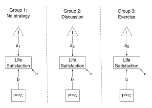

# One-Way ANCOVA


Thompson, M., Lie, Y. & Green, S. (2023). Flexible structural equation
modeling approaches for analyzing means. In R. Hoyle (Ed.), *Handbook of
structural equation modeling* (2nd ed., pp. 385-408). New York, NY:
Guilford Press.

<br />

This example shows the SEM approach to Part 2: One-way ANCOVA. Results
are reported in Table 21.2 (p. 393).

The data file (`satisfactionI.csv` in the `data` folder) needs
manipulation before it can be used: the format needs to be changed from
“long” to “wide”; and the pre or before Life Satisfaction scores need to
be centered. These manipulations are completed in `ANOVA_data.r`.

<br />

#### Load relevant packages and get the data

Load the relevant packages, and run `ANOVA_data.r` to get the data.

``` r
library(lavaan)
library(here)         # Relative paths

path <- here::here("Green_2023", "data", "ANOVA_data.r")
source(path)
head(df)
```

The variables used in this example are:

- x - Coping Strategy (“a” - no strategy; “b” - discussion; “c” -
  exercise)
- y - dependent variable (“after” self-satisfaction scores)
- preC - pre-score grand mean centered

The steps are the same as with the one_way_ANOVA. The only difference is
the addition of the covariate, preC.

<br />

### Structural Equation Modeling using **lavaan**

The SEM model for one-way ANCOVA is shown below. The diagram shows the
“Less Constrained” model - the three means, represented by the label on
the arrows connecting the “1” to the dependent variable, differ. To be
consistent with the ANCOVA assumptions of homogeneity of variances and
homogeneity of regression slopes, the residual variances and the
coefficients for the covariate (preC) are constrained to be equal.



The model statements are shown below. The “More Constrained” model
constrains the means to equality. The “Less Constrained” model allows
the means to differ across the groups. In both cases the residual
variances and the coefficients for the covariate are constrained to
equality.

``` r
models <- list(
"More Constrained" = 
  "y ~ c(a, a, a)*1         # Means
   y ~ c(b, b, b)*preC      # Covariate
   y ~~ c(e, e, e)*y        # Variances",

"Less Constrained" = 
  "y ~ c(a1, a2, a3)*1
   y ~ c(b, b, b)*preC
   y ~~ c(e, e, e)*y"
)
```

<br />

#### Fit the models and get the results

The `lapply()` function applies the `sem()` function to the two elements
of the `models` list (with `data` set to `df`, and `group` set to the
`"x"` variable).

``` r
fit <- lapply(models, sem, data = df, group = "x")

lapply(fit, summary)
```

The “SEM” sections of Table 21.2 show the means, pooled error variances,
and the $\upchi$<sup>2</sup> test.

Scroll through the summaries to find the “Intercepts”, or extract the
means from the list of estimates of model parameters.

``` r
estimates <- lapply(fit, lavInspect, "est"); estimates    # Means are in element "alpha"

means <- list()
for (i in names(models)) {
   means[[i]] <- estimates[[i]] |>
      lapply("[[", "alpha") |>        # Means for Y and preC
      lapply("[[", 1) |>              # Means for Y
      unlist()
   }   
means
```

Compare with the means in the “SEM” section of Table 21.2.

The pooled error variances are also extracted from the list of
estimates. Recall that error variances are constrained to equality, and
therefore, the estimates for one group only (here, group “a”) are
extracted.

``` r
ErrorVar <- estimates |>
   lapply("[[", "a") |>          # Extract group "a" estimates
   lapply("[[", "psi")  |>       # Extract "psi" element
   lapply("[[", 1, 1)            # 1st column, 1st row of "psi"
ErrorVar
```

Compare with pooled error variances in Table 21.2.

To perform the $\upchi$<sup>2</sup> test (to compare the fit of the two
models), apply the `anova()` function to the two models.

``` r
Reduce(anova, fit)
```

Compare with the $\upchi$<sup>2</sup> statistic and p value in Table
21.2.

In Equation 21.9 (p. 394), TLG give calculations for R<sup>2</sup>. As
was the case with the one-way ANOVA, the relevant SSEs can be obtained
from the error variances (see `ErrorVar`) by multiplying error variance
by sample size. But again, the multiplication is not needed because
sample size will cancel out; that is, substitute the error variances
into Equation 21.9.

``` r
Rsquare <- ErrorVar |>
   Reduce(function(mc, lc) (mc - lc)/mc, x = _)  # Substitute into Eq 21.9  
c(Rsquare)
```

<br />

The R script with minimal commenting is available in
[02_one_way_ANCOVA.r](02_one_way_ANCOVA.r).
