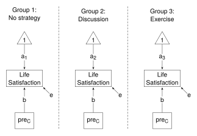

# One-Way ANCOVA


Thompson, M., Lie, Y. & Green, S. (2023). Flexible structural equation
modeling approaches for analyzing means. In R. Hoyle (Ed.), *Handbook of
structural equation modeling* (2nd ed., pp. 385-408). New York, NY:
Guilford Press.

This example shows the SEM approach to Part 2: One-way ANCOVA. Results
are reported in Table 21.2 (p. 393).

The data file needs rearranging before it can be used: the format needs
to be changed from “long” to “wide”, and the pre or before Life
Satisfaction scores need to be centered.

#### Load package and get the data

Load the **lavaan** packages, and run `satisfactionI.r` and
`ANOVA_data.r` to get and rearrange the data.

``` r
library(lavaan)

source("satisfactionI.r")
head(df)

source("ANOVA_data.r")
head(df)
```

The variables used in this example are:

- x - Coping Strategy (“a” - no strategy; “b” - discussion; “c” -
  exercise)
- y - dependent variable (“after” Life-Satisfaction scores)
- preC - pre-Life-Satisfaction scores grand mean centered

The steps are the same as with the one_way_ANOVA. The only difference is
the addition of the covariate, preC.

#### The models

The SEM model for one-way ANCOVA is shown below. The diagram shows the
“Less Constrained” model - the three means, represented by the labels on
the arrows connecting the “1” to the dependent variable, differ. To be
consistent with the ANCOVA assumptions of homogeneity of variances and
homogeneity of regression slopes, the residual variances and the
coefficients for the covariate (preC) are each constrained to equality.



The model statements are shown below. The “More Constrained” model
constrains the means to equality. The “Less Constrained” model allows
the means to differ across the groups. In both cases the residual
variances and the coefficients for the covariate are constrained to
equality.

``` r
models <- list(
  "More Constrained" =
    "y ~  c(a, a, a)*1        # Means
     y ~  c(b, b, b)*preC     # Regression slopes
     y ~~ c(e, e, e)*y        # Variances",

  "Less Constrained" =
    "y ~  c(a1, a2, a3)*1
     y ~  c(b, b, b)*preC
     y ~~ c(e, e, e)*y"
)
```

#### Fit the models and get the results

The `lapply()` function applies the `sem()` function to the two elements
of the `models` list (with `data` set to `df`, and `group` set to the
`"x"` variable).

``` r
fit <- lapply(models, sem, data = df, group = "x")

lapply(fit, summary)
```

The “SEM” sections of Table 21.2 show the means, pooled error variances,
and the $\upchi$<sup>2</sup> test; the footnote to Table 21.2 gives the
regression coefficients.

Scroll through the summaries to find the “Intercepts”, “Variances”, and
“Regressions”; or extract them from the list of estimates of model
parameters.

``` r
## Get list of estimates
estimates <- lapply(fit, lavInspect, "est"); estimates

## Extract means - in element "alpha"
means <- list()
for (i in names(models)){
   means[[i]] <- estimates[[i]] |>
      lapply("[[", "alpha") |>       # Means for Y and preC
      sapply("[[", 1)                # Means for Y
}
means <- do.call(cbind, means); means

## Extract error variances -  in element "psi"
ErrorVar <- list()
for (i in names(models)){
   ErrorVar[[i]] <- estimates[[i]] |>
      lapply("[[", "psi")  |>        # Extract "psi" element
      sapply("[[", 1, 1)             # 1st row, 1st column of "psi"
}
ErrorVar <- do.call(cbind, ErrorVar); ErrorVar

## Extract regression coefficients -  in element "beta"
RegCoef <- list()
for (i in names(models)){
   RegCoef[[i]] <- estimates[[i]] |>
      lapply("[[", "beta")  |>       # Extract "beta" element
      sapply("[[", 1, 2)             # 1st row, 2nd column of "beta"
}
RegCoef <- do.call(cbind, RegCoef); RegCoef
```

To perform the $\upchi$<sup>2</sup> test (to compare the fit of the two
models), apply the `anova()` function to the two models.

``` r
Reduce(anova, fit)
```

Compare with the $\upchi$<sup>2</sup> statistic and p value in Table
21.2.

In Equation 21.9 (p. 394), Thompson, Lie & Green give calculations for
R<sup>2</sup>. As was the case with the one-way ANOVA, the relevant SSEs
can be obtained from the error variances (see `ErrorVar`) by multiplying
error variance by sample size. But again, the multiplication is not
needed because sample size will cancel out; that is, substitute the
error variances into Equation 21.9.

``` r
Rsquare <- ErrorVar["a", ] |>
   Reduce(function(mc, lc) (mc - lc)/mc, x = _)  # Substitute into Eq 21.9
Rsquare
```

<br />

<details class="code-fold">
<summary>R code with minimal commenting</summary>

``` r
## One-way ANCOVA
##
## Thompson, M., Lie, Y. & Green, S. (2023). Flexible structural equation modeling
## approaches for analyzing means. In R. Hoyle (Ed.), Handbook of structural
## equation modeling (2nd ed., pp. 385-408). New York, NY: Guilford Press.

## Load package
library(lavaan)

## Get the data
source("satisfactionI.r")
head(df)

## Rearrange the data file
source("ANOVA_data.r")
head(df)

## The models
models <- list(
  "More Constrained" =
    "y ~  c(a, a, a)*1        # Means
     y ~  c(b, b, b)*preC     # Regression slopes
     y ~~ c(e, e, e)*y        # Variances",

  "Less Constrained" =
    "y ~  c(a1, a2, a3)*1
     y ~  c(b, b, b)*preC
     y ~~ c(e, e, e)*y"
)

## Fit the models
fit <- lapply(models, sem, data = df, group = "x")

## Get model summaries
## Check results with "SEM" section of Table 21.2
lapply(fit, summary)

## Extract means, variances, and regression coefficients from list of estimates
## Get list of estimates
estimates <- lapply(fit, lavInspect, "est"); estimates

## Extract means - in element "alpha"
means <- list()
for (i in names(models)){
   means[[i]] <- estimates[[i]] |>
      lapply("[[", "alpha") |>       # Means for Y and preC
      sapply("[[", 1)                # Means for Y
}
means <- do.call(cbind, means); means

## Extract error variances -  in element "psi"
ErrorVar <- list()
for (i in names(models)){
   ErrorVar[[i]] <- estimates[[i]] |>
      lapply("[[", "psi")  |>        # Extract "psi" element
      sapply("[[", 1, 1)             # 1st row, 1st column of "psi"
}
ErrorVar <- do.call(cbind, ErrorVar); ErrorVar

## Extract regression coefficients -  in element "beta"
RegCoef <- list()
for (i in names(models)){
   RegCoef[[i]] <- estimates[[i]] |>
      lapply("[[", "beta")  |>       # Extract "beta" element
      sapply("[[", 1, 2)             # 1st row, 2nd column of "beta"
}
RegCoef <- do.call(cbind, RegCoef); RegCoef

## Contrast model fits
## Check with chi sq statistic and p value in Table 21.2
Reduce(anova, fit)

## R square
## Check with Equation 21.9
Rsquare <- ErrorVar["a", ] |>
   Reduce(function(mc, lc) (mc - lc)/mc, x = _)  # Substitute into Eq 21.9
Rsquare
```

</details>

<details class="code-fold">
<summary>R code to get data file - `satisfactionI.r`</summary>

``` r
### Data for Tables 21.1, 21.2, 21.3, 21.4 ###

df <- structure(list(x = c("a", "a", "a", "a", "a", "a", "a", "a", 
"a", "a", "a", "a", "a", "a", "a", "a", "a", "a", "b", "b", "b", 
"b", "b", "b", "b", "b", "b", "b", "b", "b", "c", "c", "c", "c", 
"c", "c", "c", "c", "c", "c", "c", "c", "c", "c", "c", "c", "c", 
"c"), g = c("m", "m", "m", "m", "m", "m", "f", "f", "f", "m", 
"m", "m", "m", "m", "m", "f", "f", "f", "m", "m", "m", "f", "f", 
"f", "m", "m", "m", "f", "f", "f", "m", "m", "m", "f", "f", "f", 
"f", "f", "f", "m", "m", "m", "f", "f", "f", "f", "f", "f"), 
    c = c("before", "before", "before", "before", "before", "before", 
    "before", "before", "before", "after", "after", "after", 
    "after", "after", "after", "after", "after", "after", "before", 
    "before", "before", "before", "before", "before", "after", 
    "after", "after", "after", "after", "after", "before", "before", 
    "before", "before", "before", "before", "before", "before", 
    "before", "after", "after", "after", "after", "after", "after", 
    "after", "after", "after"), y = c(21, 19, 22, 21, 24, 23, 
    21, 24, 23, 22, 22, 24, 25, 27, 30, 22, 23, 24, 23, 23, 21, 
    19, 22, 21, 30, 26, 22, 25, 26, 27, 27, 25, 24, 25, 23, 22, 
    23, 28, 26, 34, 30, 26, 26, 27, 28, 29, 40, 42)), class = "data.frame", row.names = c(NA, 
-48L))


head(df)

## x - Coping Strategy (a - No strategy; b - Discussion; c - Exercise)
## g - Gender
## c - before/after 
## y - dependent variable (Life Satisfaction)
```

</details>

<details class="code-fold">
<summary>R code to rearrange data file - `ANOVA_data.r`</summary>

``` r
### Data for Tables 21.1, 21.2, 21.3, 21.4 ###

## Reshape data - long to wide
tab <- 0.5 * table(df$x)  # in each condition
df$id <- c(rep(1:tab[1], 2), rep(1:tab[2], 2), rep(1:tab[3], 2))  # id variable 

df <- reshape(df, timevar = "c", idvar = c("id", "x", "g"), varying = c("pre", "y"), 
   direction = "wide")


df <- within(df, {
## Grand mean centered "pre" - the before scores
   preC <- scale(pre, scale = FALSE)

## Drop the id variable
   id <- NULL

## Gender X Coping Strategy interaction
  sg <- interaction(x, g, sep = "")

## Dummy variables to use in regression analysis
## Dummy variables for "Coping Startegy"
   x1 <- ifelse(x == "a", 1, 0)
   x2 <- ifelse(x == "b", 1, 0)
   x3 <- ifelse(x == "c", 1, 0)

## Dummy variables for interaction
  dummies <- model.matrix(~ sg - 1)
})

## Unnest the nested 'dummies' matrix, and rename its colomns
df <- do.call(data.frame, df)
names(df) <- gsub("dummies.sg", "", names(df))
```

</details>
