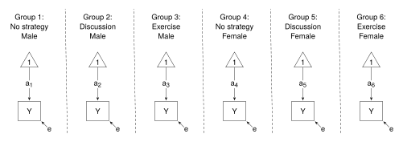

# Two-Way ANOVA


<style> 
.math.display .MathJax {
  font-size: 95% !important;
}
</style>

Thompson, M., Lie, Y. & Green, S. (2023). Flexible structural equation
modeling approaches for analyzing means. In R. Hoyle (Ed.), *Handbook of
structural equation modeling* (2nd ed., pp. 385-408). New York, NY:
Guilford Press. <br />

This example shows the OLS regression approach and the SEM approach to
Part 3: Two-way ANOVA. Results are reported in Tables 21.3 and 21.4
(pp. 395, 396).

The data file (`satisfactionI.csv` in the `data` folder) needs
manipulation before it can be used: the format needs to be changed from
“long” to “wide”; dummy variables need to be set up for the groups, and
the Gender X Coping Strategy interaction needs a grouping variable set
up for the cell-means approach, and this grouping variable in turn need
dummy variables (0, 1) for the dummy variable approach. These
manipulations are completed in `ANOVA_data.r`.

<br />

#### Load relevant packages and get the data

Load the relevant packages, and run `ANOVA_data.r` to get the data.

``` r
library(lavaan)
library(restriktor)   # to restrict means
library(DescTools)    # Cramer's V

source("./data/ANOVA_data.r")
head(df)
```

The variables used in this example are:

- x - Coping Strategy (“a” - no strategy; “b” - discussion; “c” -
  exercise)
- g - Gender
- y - dependent variable (“after” self-satisfaction scores)
- x1, x2, x3 - dummy coded variables (1, 0) for “Coping Strategy”
- sg - Gender X Coping Strategy interaction
- af, bf, cf, … cm - dummy coding for interaction

<br />

#### Preliminary results - Cramer’s V

On page 394, TLG give Cramer’s V for the Gender X Coping Strategy
crosstabulation. As far as I know, Cramer’s V is not available in base
R, but **DescTools** is one of possibly many packages that has a
function for Cramer’s V.

``` r
DescTools::CramerV(df$g, df$x)
```

However, it is easy to calculate Cramer’s V without the need for the
extra package, given the formula:

$$
 \mathsf{Cramer's ~ V} = \sqrt{\frac{\upchi^2 / n}{\min(r-1, ~ c-1)}}
$$

where $n$ is the sample size, $r$ is the number of rows, and $c$ is the
number of columns.

``` r
chisq <- unname(chisq.test(df$g, df$x)$statistic)
n <- length(df$g)           # Sample size
r <- length(unique(df$g))   # Number of rows
c <- length(unique(df$x))   # Number of columns

CV <- sqrt((chisq/n)/min(r-1, c-1)); CV
```

Standardised residuals will give the direction of the relationship
(p. 394).

``` r
chisq.test(df$g, df$x)$stdres 
```

<br />

#### Preliminary results - Gender X Coping Strategy crosstabulation

Table 21.3 (p. 395) gives the cell means and frequecies, and the
weighted and unweighted marginal means.

Get the cell means and frequencies.

``` r
means <- tapply(df$y, list(df$g, df$x), mean); means     # cell means
freq <- table(df$g, df$x); freq                          # cell frequencies
```

Get the unweighted and weighted marginal means.

``` r
# Unweighted marginal means
apply(means, 1, mean)      # Gender
apply(means, 2, mean)      # Coping Strategy
 
# Weighted marginal means
tapply(df$y, df$g, mean)     # Gender
tapply(df$y, df$x, mean)     # Coping Strategy   
```

<br />

### OLS regression

The **restriktor** package allows complex and multiple contraints to be
imposed.

The “Less Constrained” model allows the six means to differ. “More
Constrained” models constrain the means in such a way that, when the fit
of a “More Constrained” model is compared to the fit of the “Less
Constrained” model, it is possible to test for the “Coping Strategy”
main effect, or for the “Gender” main effect, or for the Gender X Coping
Strategy interaction. These effects can be tested for unweighted means
or for weighted means. The models can be set up using the cell-means
formulation or using dummy variables. Table 21.4 (p. 396) shows the
results for the test of the “Coping Strategy” main effect for weighted
means. In what follows I show the tests for both main effects and the
interaction for weighted and unweighted means.

The “Less Constrained” model is set up using the `lm()` function as
usual. The “More Constrained” models are set up as constraints to be
passed to the `iht()` function of the **restriktor** package. The
`iht()` function takes as input the “Less Contrained” model and the
constraints.

<br />

#### Cell-means formulation - unweighted means

The “Less Constrained” model

``` r
lc <- lm(y ~ -1 + sg, df)
summary(lc)
```

To test the Gender main effect (applied to unweighted means), the
restriction constrains the mean for males to equal the mean for females.
But there are three means for males and three means for females. Simply
constrain the sum of the three means for males to equal the sum of the
three means for females.

``` r
constraints <- "(sgaf + sgbf + sgcf) == (sgam + sgbm + sgcm)"
test <- iht(lc, constraints = constraints, type = "A", test = "F"); test

test$df; test$df.residual
```

Similarly, to test for the “Coping Strategy” main effect, restrict the
mean for “a” strategy to equal the mean for “b” strategy to equal the
mean for “c” strategy. That is, constrain the sum of the two “a” means
to equal the sum of the two “b” means; and the sum of the two “b” means
to equal the sum of the two “c” means.

``` r
constraints <- "(sgaf + sgam) == (sgbf + sgbm)
                (sgbf + sgbm) == (sgcf + sgcm)"
test <- iht(lc, constraints = constraints, type = "A", test = "F"); test

test$df; test$df.residual
```

<br />

#### Cell-means formulation - weighted means

To test for the main effects applied to weighted means, the constraints
are set the same way as before except this time the means are weighted
in proportion to the cell frequencies.

The Gender main effect applied to weighted means

``` r
freq                     # cell frequencies to construct constraints
constraints <- "(3/12*sgaf + 3/12*sgbf + 6/12*sgcf) == (6/12*sgam + 3/12*sgbm + 3/12*sgcm)"
test <- iht(lc, constraints = constraints, type = "A", test = "F"); test

test$df; test$df.residual
```

The “Coping Strategy” main effect applied to weighted means. These
results are reported in Table 21.4. Compare the estimates (“restricted”
and “unrestricted”) and the F-test results in the output with the cell
means and the F test in Table 21.4.

``` r
freq                     # cell frequencies to construct constraints
constraints <- "(3/9*sgaf + 6/9*sgam) == (3/6*sgbf + 3/6*sgbm)
                (3/6*sgbf + 3/6*sgbm) == (6/9*sgcf + 3/9*sgcm)"
test <- iht(lc, constraints = constraints, type = "A", test = "F"); test

test$df; test$df.residual
```

To test for the Gender X Coping Strategy interaction, the “More
Constrained” model needs the means to be constrained so that the
difference between the mean for “female” and the mean for “male” remains
constant across levels of “Coping Strategy”. That is:

the difference between “female” mean and “male” mean for the “a”
strategy equals the difference between “female” mean and “male” mean for
the “b” strategy; and the difference between “female” mean and “male”
mean for the “b” strategy equals the difference between “female” mean
and “male” mean for the “c” strategy.

``` r
constraints <- "(sgaf - sgam) == (sgbf - sgbm) 
                (sgbf - sgbm) == (sgcf - sgcm)"
test <- iht(lc, constraints = constraints, type = "A", test = "F"); test

test$df; test$df.residual
```

<br />

#### Dummy variable formulation

Formulation of the models in terms of dummy variables proceeds much the
same as before except the formulation of the “Less Constrained” model
and the constraints are in terms of the dummy variables.

``` r
# Less constrained model
lc <- lm(y ~ -1 + af + bf + cf + am + bm + cm, df)
summary(lc)


# More constrained models
# Gender main effect - unweighted means
constraints <- "(af + bf + cf) == (am + bm + cm)"
test <- iht(lc, constraints = constraints, type = "A", test = "F"); test

test$df; test$df.residual

# Coping Strategy main effect - unweighted means
constraints <- "(af + am) == (bf + bm)
                (bf + bm) == (cf + cm)"
test <- iht(lc, constraints = constraints, type = "A", test = "F"); test

test$df; test$df.residual

# Gender main effect - weighted means
freq
constraints <- "(3/12*af + 3/12*bf + 6/12*cf) == (6/12*am + 3/12*bm + 3/12*cm)"
test <- iht(lc, constraints = constraints, type = "A", test = "F"); test

test$df; test$df.residual

# Coping Strategy main effect - weighted means
constraints <- "(3/9*af + 6/9*am) == (3/6*bf + 3/6*bm)
                (3/6*bf + 3/6*bm) == (6/9*cf + 3/9*cm)"
test <- iht(lc, constraints = constraints, type = "A", test = "F"); test

test$df; test$df.residual

# Interaction: Gender X Coping Strategy
constraints <- "(af - am) == (bf - bm) 
                (bf - bm) == (cf - cm)"
test <- iht(lc, constraints = constraints, type = "A", test = "F"); test

test$df; test$df.residual
```

<br />

### Structural Equation Modeling

The SEM model for two-way ANOVA is shown below. The diagram shows the
“Less Constrained” model - the six means, represented by the label on
the arrows connecting the “1” to the dependent variable, differ. To be
consistent with the ANOVA assumptions of homogeneity of variances, the
residual variances are constrained to be equal.



The model statements are shown below. The “Less Constrained” model
allows the means (represented by the labels, am, af, …, cf) to differ
across the groups. The constraints are the same as above for the
cell-means approach. The constraints statements are added to the “Less
Constrained” statement to give the “More Constrained” models. The “More
Constrained” models are constrasted with the “Less Constrained” model to
test for the main effects (weighted and unweighted) and the interaction.
In each case the residual variances are constrained to equality.

``` r
unique(df$sg)    # order in which groups appear in lavaan output

# Less Constrained model
lc <- "y ~ c(am, af, bm, bf, cm, cf)*1       # Means
       y ~~ c(e, e, e, e, e, e)*y"           # Variances

lc.fit <- sem(lc, data = df, group = "sg")
summary(lc.fit)


# Gender main effect - unweighted means
constraints <- "af + bf + cf == am + bm + cm"
gend_unw <- c(lc, constraints)

gend_unw.fit <- sem(gend_unw, data = df, group = "sg")
summary(gend_unw.fit)

anova(gend_unw.fit, lc.fit)   # Compare the two models


# Coping Strategy main effect - unweighted means
constraints <- "
   af + am == bf + bm 
   af + am == cf + cm"
strat_unw <- c(lc, constraints)

strat_unw.fit <- sem(strat_unw, data = df, group = "sg")
summary(strat_unw.fit)

anova(strat_unw.fit, lc.fit)   # Compare the two models


# Gender main effect - weighted means
freq
constraints <- "(3*af + 3*bf + 6*cf)/12 == (6*am + 3*bm + 3*cm)/12"
gend_w = c(lc, constraints)

gend_w.fit <- sem(gend_w, data = df, group = "sg")
summary(gend_w.fit)

anova(gend_w.fit, lc.fit)   # Compare the two models


# Coping Strategy main effect - weighted means
# Compare with SEM section in Table 21.4
freq
constraints <- "
   (3*af + 6*am)/9 == (3*bf + 3*bm)/6 
   (3*bf + 3*bm)/6 == (6*cf + 3*cm)/9"
strat_w <- c(lc, constraints)

strat_w.fit <- sem(strat_w, data = df, group = "sg")
summary(strat_w.fit)

anova(strat_w.fit, lc.fit)   # Compare the two models


# Gender X Coping Strategy interaction
constraints <- "
   (af - am) == (bf - bm) 
   (bf - bm) == (cf - cm)"
inter <- c(lc, constraints)

inter.fit <- sem(inter, data = df, group = "sg")
summary(inter.fit)

anova(inter.fit, lc.fit) 
```

<br />

The R script with minimal commenting is available in
[03_two_way_ANOVA.r](03_two_way_ANOVA.r).
