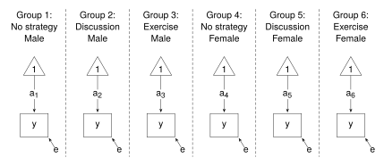

# Two-Way ANOVA


<style>
.math.display .MathJax {
  font-size: 95% !important;
}
</style>

Thompson, M., Lie, Y. & Green, S. (2023). Flexible structural equation
modeling approaches for analyzing means. In R. Hoyle (Ed.), *Handbook of
structural equation modeling* (2nd ed., pp. 385-408). New York, NY:
Guilford Press.

This example shows the SEM approach to Part 3: Two-way ANOVA. Results
are reported in Tables 21.3 and 21.4 (pp. 395, 396).

The data file needs rearranging before it can be used: the format needs
to be changed from “long” to “wide”, and the Gender X Coping Strategy
interaction needs a grouping variable set up.

#### Load packages and get the data

Load the relevant packages, and run `satisfactionI.r` and `ANOVA_data.r`
to get and rearrange the data.

``` r
library(lavaan)
library(DescTools)    # Cramer's V

source("satisfactionI.r")
head(df)

source("ANOVA_data.r")
head(df)
```

The variables used in this example are:

- x - Coping Strategy (“a” - no strategy; “b” - discussion; “c” -
  exercise)
- g - Gender
- y - dependent variable (“after” Life-Satisfaction scores)
- sg - Gender X Coping Strategy interaction

#### Preliminary results - Cramer’s V

On page 394, Thompson, Lie & Green give Cramer’s V for the Gender X
Coping Strategy crosstabulation. As far as I know, Cramer’s V is not
available in base R, but **DescTools** is one of possibly many packages
that has a function for Cramer’s V.

``` r
DescTools::CramerV(df$g, df$x)
```

However, it is easy to calculate Cramer’s V without the need for the
extra package, given the formula:

$$
 \mathsf{Cramer's ~ V} = \sqrt{\frac{\upchi^2 / n}{\min(r-1, ~ c-1)}}
$$

where $n$ is the sample size, $r$ is the number of rows, and $c$ is the
number of columns.

``` r
chisq <- unname(chisq.test(df$g, df$x)$statistic)
n <- nrow(df)               # Sample size
r <- length(unique(df$g))   # Number of rows
c <- length(unique(df$x))   # Number of columns

CV <- sqrt((chisq/n)/min(r-1, c-1)); CV
```

Standardised residuals will give the direction of the relationship
(p. 394).

``` r
chisq.test(df$g, df$x)$stdres
```

#### Preliminary results - Gender X Coping Strategy crosstabulation

Table 21.3 (p. 395) gives the cell means and frequecies, and the
weighted and unweighted marginal means.

Get the cell means and frequencies.

``` r
means <- with(df, tapply(y, list(g, x), mean)); means     # Cell means
freq  <- with(df, table(g, x)); freq                      # Cell frequencies
```

Get the unweighted and weighted marginal means.

``` r
# Unweighted marginal means
apply(means, 1, mean)      # Gender
apply(means, 2, mean)      # Coping Strategy
 
# Weighted marginal means
with(df, tapply(y, g, mean))     # Gender
with(df, tapply(y, x, mean))     # Coping Strategy
```

#### The models

The SEM model for two-way ANOVA is shown below. The diagram shows the
“Less Constrained” model - the six means, represented by the label on
the arrows connecting the “1” to the dependent variable, differ. To be
consistent with the ANOVA assumption of homogeneity of variances, the
residual variances are constrained to be equal.



The model statements are shown below. The “Less Constrained” model
allows the means (represented by the labels, am, af, …, cf) to differ
across the groups. The constraints statements are added to the “Less
Constrained” statement to give the “More Constrained” models. The “More
Constrained” models are contrasted with the “Less Constrained” model to
test for the Gender and Coping Strategy main effects (weighted and
unweighted) and the Gender X Coping Strategy interaction. In each case
the residual variances are constrained to equality.

Constraint for the unweighted Gender main effect - Restrict the mean for
males to equal the mean for females. But there are three means for
females, one for each Coping Strategy group. Similarly, there are three
means for males. Simply constrain the sum of the three means for males
to equal the sum of the three means for females.

Constraints for the unweighted Coping Strategy main effect - Restrict
the mean for “a” strategy to equal the mean for “b” strategy to equal
the mean for “c” strategy. That is, constrain the sum of the two “a”
means to equal the sum of the two “b” means; and the sum of the two “b”
means to equal the sum of the two “c” means.

To test for the main effects applied to weighted means, the constraints
are set the same way as before except the means are weighted in
proportion to the cell frequencies.

Constraints for the Gender X Coping Strategy interaction - The “More
Constrained” model needs the means to be constrained so that the
difference between the mean for “female” and the mean for “male” remains
constant across levels of “Coping Strategy”. That is: the difference
between “female” mean and “male” mean for the “a” strategy equals the
difference between “female” mean and “male” mean for the “b” strategy;
and the difference between “female” mean and “male” mean for the “b”
strategy equals the difference between “female” mean and “male” mean for
the “c” strategy.

``` r
## Less Constrained model
lc <- "y ~  c(am, af, bm, bf, cm, cf)*1      # Means
       y ~~ c(e, e, e, e, e, e)*y            # Variances"

lc.fit <- sem(lc, data = df, group = "sg")
summary(lc.fit)

## Gender main effect - unweighted means
constraints <- "af + bf + cf == am + bm + cm"
gend_unw <- c(lc, constraints)

gend_unw.fit <- sem(gend_unw, data = df, group = "sg")
summary(gend_unw.fit)

anova(gend_unw.fit, lc.fit)   # Compare the two models

## Coping Strategy main effect - unweighted means
constraints <- 
  "af + am == bf + bm 
   af + am == cf + cm"
strat_unw <- c(lc, constraints)

strat_unw.fit <- sem(strat_unw, data = df, group = "sg")
summary(strat_unw.fit)

anova(strat_unw.fit, lc.fit)   # Compare the two models

## Gender main effect - weighted means
freq                     # To assist with constructing constraints
constraints <- "(3*af + 3*bf + 6*cf)/12 == (6*am + 3*bm + 3*cm)/12"
gend_w <- c(lc, constraints)

gend_w.fit <- sem(gend_w, data = df, group = "sg")
summary(gend_w.fit)

anova(gend_w.fit, lc.fit)   # Compare the two models

## Coping Strategy main effect - weighted means
## Compare with SEM section in Table 21.4
freq
constraints <- 
  "(3*af + 6*am)/9 == (3*bf + 3*bm)/6 
   (3*bf + 3*bm)/6 == (6*cf + 3*cm)/9"
strat_w <- c(lc, constraints)

strat_w.fit <- sem(strat_w, data = df, group = "sg")
summary(strat_w.fit)

anova(strat_w.fit, lc.fit)   # Compare the two models

## Gender X Coping Strategy interaction
constraints <- 
  "(af - am) == (bf - bm)
   (bf - bm) == (cf - cm)"
inter <- c(lc, constraints)

inter.fit <- sem(inter, data = df, group = "sg")
summary(inter.fit)

anova(inter.fit, lc.fit)     # Compare the two models
```

<br />

<details class="code-fold">
<summary>R code with minimal commenting</summary>

``` r
## Two-way ANOVA
##
## Thompson, M., Lie, Y. & Green, S. (2023). Flexible structural equation modeling
## approaches for analyzing means. In R. Hoyle (Ed.), Handbook of structural
## equation modeling (2nd ed., pp. 385-408). New York, NY: Guilford Press.

## Load packages
library(lavaan)
library(DescTools)    # Cramer's V

## Get the data
source("satisfactionI.r")
head(df)

## Rearrange the data file
source("ANOVA_data.r")
head(df)

## Cramer's V
## Check with page 394
DescTools::CramerV(df$g, df$x)

## Cramer's V by hand
chisq <- unname(chisq.test(df$g, df$x)$statistic)
n <- nrow(df)               # Sample size
r <- length(unique(df$g))   # Number of rows
c <- length(unique(df$x))   # Number of columns

CV <- sqrt((chisq/n)/min(r-1, c-1)); CV

## Direction of the relationship
chisq.test(df$g, df$x)$stdres

## Cell means and cell frequencies
## Check cell means and frequencies in Table 21.3
means <- with(df, tapply(y, list(g, x), mean)); means     # Cell means
freq  <- with(df, table(g, x)); freq                      # Cell frequencies

## Check unweighted and weighted means in Table 21.3
# Unweighted marginal means
apply(means, 1, mean)      # Gender
apply(means, 2, mean)      # Coping Strategy

# Weighted marginal means
with(df, tapply(y, g, mean))     # Gender
with(df, tapply(y, x, mean))     # Coping Strategy

## Less Constrained model
lc <- "y ~  c(am, af, bm, bf, cm, cf)*1      # Means
       y ~~ c(e, e, e, e, e, e)*y            # Variances"

lc.fit <- sem(lc, data = df, group = "sg")
summary(lc.fit)

## Gender main effect - unweighted means
constraints <- "af + bf + cf == am + bm + cm"
gend_unw <- c(lc, constraints)

gend_unw.fit <- sem(gend_unw, data = df, group = "sg")
summary(gend_unw.fit)

anova(gend_unw.fit, lc.fit)   # Compare the two models

## Coping Strategy main effect - unweighted means
constraints <-
  "af + am == bf + bm
   af + am == cf + cm"
strat_unw <- c(lc, constraints)

strat_unw.fit <- sem(strat_unw, data = df, group = "sg")
summary(strat_unw.fit)

anova(strat_unw.fit, lc.fit)   # Compare the two models

## Gender main effect - weighted means
freq                     # To assist with constructing constraints
constraints <- "(3*af + 3*bf + 6*cf)/12 == (6*am + 3*bm + 3*cm)/12"
gend_w <- c(lc, constraints)

gend_w.fit <- sem(gend_w, data = df, group = "sg")
summary(gend_w.fit)

anova(gend_w.fit, lc.fit)   # Compare the two models

## Coping Strategy main effect - weighted means
## Compare with SEM section in Table 21.4
freq
constraints <-
  "(3*af + 6*am)/9 == (3*bf + 3*bm)/6
   (3*bf + 3*bm)/6 == (6*cf + 3*cm)/9"
strat_w <- c(lc, constraints)

strat_w.fit <- sem(strat_w, data = df, group = "sg")
summary(strat_w.fit)

anova(strat_w.fit, lc.fit)   # Compare the two models

## Gender X Coping Strategy interaction
constraints <-
  "(af - am) == (bf - bm)
   (bf - bm) == (cf - cm)"
inter <- c(lc, constraints)

inter.fit <- sem(inter, data = df, group = "sg")
summary(inter.fit)

anova(inter.fit, lc.fit)     # Compare the two models
```

</details>

<details class="code-fold">
<summary>R code to get data file - `satisfactionI.r`</summary>

``` r
### Data for Tables 21.1, 21.2, 21.3, 21.4 ###

df <- structure(list(x = c("a", "a", "a", "a", "a", "a", "a", "a", 
"a", "a", "a", "a", "a", "a", "a", "a", "a", "a", "b", "b", "b", 
"b", "b", "b", "b", "b", "b", "b", "b", "b", "c", "c", "c", "c", 
"c", "c", "c", "c", "c", "c", "c", "c", "c", "c", "c", "c", "c", 
"c"), g = c("m", "m", "m", "m", "m", "m", "f", "f", "f", "m", 
"m", "m", "m", "m", "m", "f", "f", "f", "m", "m", "m", "f", "f", 
"f", "m", "m", "m", "f", "f", "f", "m", "m", "m", "f", "f", "f", 
"f", "f", "f", "m", "m", "m", "f", "f", "f", "f", "f", "f"), 
    c = c("before", "before", "before", "before", "before", "before", 
    "before", "before", "before", "after", "after", "after", 
    "after", "after", "after", "after", "after", "after", "before", 
    "before", "before", "before", "before", "before", "after", 
    "after", "after", "after", "after", "after", "before", "before", 
    "before", "before", "before", "before", "before", "before", 
    "before", "after", "after", "after", "after", "after", "after", 
    "after", "after", "after"), y = c(21, 19, 22, 21, 24, 23, 
    21, 24, 23, 22, 22, 24, 25, 27, 30, 22, 23, 24, 23, 23, 21, 
    19, 22, 21, 30, 26, 22, 25, 26, 27, 27, 25, 24, 25, 23, 22, 
    23, 28, 26, 34, 30, 26, 26, 27, 28, 29, 40, 42)), class = "data.frame", row.names = c(NA, 
-48L))


head(df)

## x - Coping Strategy (a - No strategy; b - Discussion; c - Exercise)
## g - Gender
## c - before/after 
## y - dependent variable (Life Satisfaction)
```

</details>

<details class="code-fold">
<summary>R code to rearrange data file - `ANOVA_data.r`</summary>

``` r
### Data for Tables 21.1, 21.2, 21.3, 21.4 ###

## Reshape data - long to wide
tab <- 0.5 * table(df$x)  # in each condition
df$id <- c(rep(1:tab[1], 2), rep(1:tab[2], 2), rep(1:tab[3], 2))  # id variable 

df <- reshape(df, timevar = "c", idvar = c("id", "x", "g"), varying = c("pre", "y"), 
   direction = "wide")


df <- within(df, {
## Grand mean centered "pre" - the before scores
   preC <- scale(pre, scale = FALSE)

## Drop the id variable
   id <- NULL

## Gender X Coping Strategy interaction
  sg <- interaction(x, g, sep = "")

## Dummy variables to use in regression analysis
## Dummy variables for "Coping Startegy"
   x1 <- ifelse(x == "a", 1, 0)
   x2 <- ifelse(x == "b", 1, 0)
   x3 <- ifelse(x == "c", 1, 0)

## Dummy variables for interaction
  dummies <- model.matrix(~ sg - 1)
})

## Unnest the nested 'dummies' matrix, and rename its colomns
df <- do.call(data.frame, df)
names(df) <- gsub("dummies.sg", "", names(df))
```

</details>
