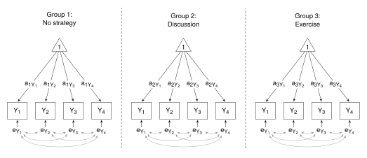

# One-Way MANOVA


<style> 
.math.inline .MathJax {
  font-size: 98% !important;
}
.math.display .MathJax {
  font-size: 97% !important;
}
&#10;</style>

Thompson, M., Lie, Y. & Green, S. (2023). Flexible structural equation
modeling approaches for analyzing means. In R. Hoyle (Ed.), *Handbook of
structural equation modeling* (2nd ed., pp. 385-408). New York, NY:
Guilford Press.

<br />

This example shows the SEM approach to Part 4: One-way MANOVA. Results
are reported in Table 21.5 (p. 399).

The data file (`satisfactionII.csv`) is in the `data` folder.

<br />

#### Load package and get the data

``` r
library(lavaan)
library(here)             # Relative paths

path <- here::here("Green_2023", "data", "satisfactionII.csv")
df <- read.csv(path, header = TRUE)
head(df)
```

The variables used in this example are:

- x - Coping Strategy (“a” - no strategy; “b” - discussion; “c” -
  exercise)
- y1, y2, y3, y4 - multiple dependent variables (life-satisfaction
  scores)

<br />

### Structural Equation Modeling using **lavaan**

The SEM model for the one-way MANOVA is shown in Fig 21.2 (p. 400), and
is reproduced below. The diagram shows the “Less Constrained” model. The
means are represented by the labels on the arrows connecting the “1” to
the dependent variables. The means for each variable are allowed to
differ across the groups. The residual variances and covariances are
constrained to equality.



The model statements are shown below. The “More Constrained” model
constrains the means to equality. The “Less Constrained” model allows
the means to differ across the groups. In both cases the residual
variances and covariances are constrained to equality. The variancs and
covariances can be set up separately - see `vcov` below. Then, `vcov` is
added back into each model. Saves a little typing.

``` r
# Model statements

# Variances and covariances (for both models)
vcov = 
   "y1 ~~ c(e1, e1, e1)*y1
    y2 ~~ c(e2, e2, e2)*y2
    y3 ~~ c(e3, e3, e3)*y3
    y4 ~~ c(e4, e4, e4)*y4

    y1 ~~ c(e12, e12, e12)*y2
    y1 ~~ c(e13, e13, e13)*y3
    y1 ~~ c(e14, e14, e14)*y4
    y2 ~~ c(e23, e23, e23)*y3
    y2 ~~ c(e24, e24, e24)*y4
    y3 ~~ c(e34, e34, e34)*y4"

models <- list(
"More Constrained" = c(
# Means
   "y1 ~ c(a1, a1, a1)*1
    y2 ~ c(a2, a2, a2)*1
    y3 ~ c(a3, a3, a3)*1
    y4 ~ c(a4, a4, a4)*1",
    
    vcov),
    
"Less Constrained" =  c(
# Means
   "y1 ~ c(a1, b1, c1)*1
    y2 ~ c(a2, b2, c2)*1
    y3 ~ c(a3, b3, c3)*1
    y4 ~ c(a4, b4, c4)*1",
    
    vcov)
)
```

<br />

#### Fit the models and get the results

``` r
# Fit the models 
fit <- lapply(models, sem, data = df, group = "x")

# Get model summaries
lapply(fit, summary)        # Means are "Intercepts"

# Contrast model fits
Reduce(anova, fit)
```

The “SEM” section of Table 21.5 shows the $\upchi$<sup>2</sup> test.

Scroll through the summaries to find the “Intercepts”, or extract the
means from the list of estimates of model parameter.

``` r
(estimates <- lapply(fit, lavInspect, "est"))    # Note: means are in element "nu"

means <- list()
for (i in names(models)) { 
   means[[i]] = estimates[[i]] |>
      lapply("[[", "nu") |>
      do.call(cbind, args = _) |>
      t() |>
      round(2)
   row.names(means[[i]]) = c("a", "b", "c")
      }
means
```

Campare with the means in Table 21.5.

By way of completeness, get the error SSCP matrices. (TLG state that,
“the error SSCP matrices were perfectly reproduced by multiplying the
variances and covariances in the SEM output by the total sample size”
p. 398).

``` r
# Note: In the list of estimates, variances and covariances are in element "theta"
   E = estimates |>
   lapply("[[", "a") |>           # Extract estimates for group "a"
   lapply("[[", "theta") |>       # Extract "theta" element
   lapply(matrix, nrow = 4) |>    # Get the full matrix
   lapply("*", 200)               # Multiply by sample size
E
```

<br />

### Relax homogeneity of variances and covariances assumption

Towards the end of the section headed “Avoiding OLS assumptions for
ANOVA/MANOVA designs using SEM” (pp. 398-401), TGL present the results
for models in which the assumptions of homogeneity and normality are
relaxed. That is, variances and covariances are not constrained to
equality, and a robust ML method of estimation (MLM) is employed. Again,
the variances and covariances are set up separately, then added back
into each model. This time, there are no labels for the variances and
covariances, meaning that **lavaan** will estimate each variance and
covariance for each group.

``` r
# Model statements

# Variances and covariances (for both models)
vcov = "
   y1 ~~ y1 + y2 + y3 + y4
   y2 ~~ y2 + y3 + y4
   y3 ~~ y3 + y4
   y4 ~~ y4"

models <- list(

"Less Constrained" =  c(
# Means
   "y1 ~ c(a1, b1, c1)*1
    y2 ~ c(a2, b2, c2)*1
    y3 ~ c(a3, b3, c3)*1
    y4 ~ c(a4, b4, c4)*1",
    
    vcov),

"More Constrained" = c(
# Means
   "y1 ~ c(a1, a1, a1)*1
    y2 ~ c(a2, a2, a2)*1
    y3 ~ c(a3, a3, a3)*1
    y4 ~ c(a4, a4, a4)*1",
    
    vcov)
)

# Fit the models 
fit <- lapply(models, sem, data = df, estimator = "mlm", group = "x")

# Get model summaries
lapply(fit, summary)

# Contrast model fits
Reduce(anova, fit)
```

Compare with the $\upchi$<sup>2</sup> test on page 401.

<br />

The R script with minimal commenting is available in
[04_one_way_MANOVA.r](04_one_way_MANOVA.r).
