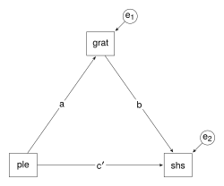

# Three-variable mediation with cross-sectional data


Jose, P. (2013). *Doing Statistical Mediation and Moderation*. New York,
NY: Guilford Press.

<br />

This example shows how to obtain a basic three-variable mediation
analysis using **lavaan** and how to obtain indirect and total effects.
In Chapter 3 (Basic Mediation, pp. 43-92), Jose describes a basic
mediation model involving three variables: Positive Life Events;
Happiness; and Gratitude. Positive Life Events has a direct effect on
Happiness, but also Positive Life Events has an indirect effect on
Happiness via Gratitude.

<br />

#### Load relevant packages

First, load the **lavaan** and **haven** packages.

``` r
library(lavaan)
library(haven)   # To read SPSS data files
```

<br />

#### Get the data

The data are available at the Guilford Press site (note: the url on page
48 is no longer a valid link). The data are contained in an SPSS data
file. I use the **haven** package to read SPSS data files. Examine the
file structure, in particular, noting the variable names. These will be
needed by **lavaan**.

``` r
url <- "http://www.guilford.com/add/jose/mediation_example.sav"
dataset <- data.frame(haven::read_spss(url))

str(dataset)
head(dataset)
summary(dataset)
```

The names for the three variables are:

- ple - Positive Life Events
- grat - Gratitude
- shs - Happiness

<br />

#### The model

The model is given in Figure 3.3 (p. 46), reproduced below.



In **lavaan**, mediation effects can be estimated using the `:=`
operator. In the diagram, the effects are labelled a, b, and c$'$; in
the model statement, they are labelled a, b, and cpr. The labels are
used later to obtain the indirect and total effects.

``` r
model <- "
  # indirect effect
  shs ~ cpr * ple

  #  effects via the mediator
  grat ~ a * ple
  shs ~  b * grat

  # indirect effect (a*b)
  indirect := a * b

  # total effect
  total := cpr + (a * b) 
"
```

<br />

#### Fit the model and get the results

I’ve requested unstandardised and standardised effects, and
R<sup>2</sup> values. For the standardised effects, see the “std.all”
column in the output.

``` r
fit <- sem(model, data = dataset)
summary(fit, rsquare = TRUE, standardized = TRUE)
```

Jose conducts mediation analysis using regressions. The results are
presented in a series of tables: 3.2 to 3.5 (pp. 49-52). The
unstandardised and standardised coefficients in the tables agree with
the **lavaan** output.

The regression summary table show the constants (that is, the
intercepts). If intercepts are required, include `meanstructure = TRUE`
in the `sem()` function.

``` r
fit_intercepts <- sem(model, data = dataset, meanstructure = TRUE)
summary(fit_intercepts, rsquare = TRUE, standardized = TRUE)
```

Jose shows how to calculate and test the statistical significance of
Sobel’s z-value (that is, testing the significance of the indirect
effect) on pages 53 and 54. Do not rely on that test, similarly do not
rely of the t-test for the indirect effect given in the **lavaan**
output. It is better to calculate confidence intervals, although the
symmetric confidence intervals presented in Table 3.7 (p. 55) are no
better than the test for Sobel’s z-value. The asymmetric CIs presented
in Table 3.8 (p. 56) are possibly better. In **lavaan**, bootstrap CIs
can be calculated.

``` r
fit_boot <- sem(model, data = dataset, se = "bootstrap", bootstrap = 2000)
summary(fit_boot, standardized = TRUE, ci = TRUE)
parameterEstimates(fit_boot, boot.ci.type = "perc")
```

The R script with minimal commenting is available in
[Jose_Mediation.r](Jose_Mediation.r).
