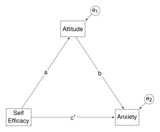

# Three-variable mediation with summary data


Kurbanoglu, N. & Takunyaci, M. (2021). A structural equation modeling on
relationship between self-efficacy, physics laboratory anxiety and
attitudes. *Journal of Family, Counseling and Education*, *6*(1), 47-56.

<br />

This example shows how to obtain a basic three-variable mediation
analysis using **lavaan**, and how to obtaining indirect and total
effects. The three variables are: Self-Efficacy; Physics Laboratory
Attitudes; and Physics Laboratory Anxiety. Anxiety has a direct effect
on Self-Efficacy, but also Anxiety has an indirect effect on
Self-Efficacy via Attitudes. This example also shows how to use summary
data when the raw sample data are not available; in particular, how to
obtain a matrix of variances and covariances from the summary data
(correlations and standard deviations), and then how to use the
covariance matrix to replicate the analysis.

<br />

#### Load relevant packages

First, load the **lavaan** and **semmcci** packages.

``` r
library(lavaan)
library(semmcci)  # For Monte Carlo CIs
```

<br />

#### Get the data

Sample data is not available, but Table 1 (p. 50) gives correlations,
means, and standard deviations, and the sample size is given on page 49.
From these, the variance/covariance matrix can be obtained. The
correlations do not need to be in the form of a matrix. All that is
required is a vector of the lower triangle of correlations with ones
along the diagonal.

``` r
cor <- c(
   1,
   0.30,  1,
  -0.42, -0.32,  1)
sds <- c(8.81, 7.95, 18.30)
means <- c(56.57, 40.39, 68.22)
n <- 513
```

The three variables need names, making sure the order is the same as in
Table 1. The names used here are:

- SE - Self-Efficacy  
- Att - Physics Laboratory Attitudes  
- Anx - Physics Laboratory Anxiety

``` r
names <- c("Att", "SE", "Anx")
```

To get the variance/covariance matrix, I use the `getCov()` function
from the **lavaan** package.

``` r
cov <- lavaan::getCov(cor, sds = sds, names = names)
```

<br />

#### The model

The model is given in Figure 1 (p. 51), reproduced below.



K&T do not estimate the indirect effect; only the “a” and “b” paths. In
**lavaan**, indirect effects can be estimated using the `:=` operator.
In the diagram, the effects are labelled are a, b, and c$'$; in the
model statement, they are labelled a, b, and cpr. The labels can then be
used to obtain the indirect and total effects.

``` r
model <- "
  # direct effect
  Anx ~ cpr * SE   # c prime

  # effects via the mediator
  Att ~ a * SE
  Anx ~ b * Att

  # indirect effect (a * b)
  ab := a * b

  # total effect
  total := cpr + (a * b)
"
```

<br />

#### Fit the model and get the results

K&T present standardised estimates and R<sup>2</sup> values; so they are
requested here (for standardised estimates, see “std.all” column in the
output).

``` r
fit <- sem(model, sample.cov = cov, sample.nobs = n)
summary(fit, rsquare = TRUE, standardized = TRUE, fit.measures = TRUE)
```

I’ve requested a selection of fit measures. Why fit measures? Afterall,
the model is saturated, and all fit measures should indicate a perfect
fit. Something has gone awry for K&T. At the bottom of page 50, they
state that the model is saturated. As a consequence, $\chi$<sup>2</sup>
and RMSEA should be zero, and GFI, AGF, CFI, NFI, RFI, and IFI should
all be one; yet values are given (p. 50) to indicate a less than perfect
fit. I’m not sure how this could have come about, or why the error was
not picked up during review.

If the intercepts are required, include `sample.mean = means` in the
`sem()` function.

``` r
fit_intercepts <- sem(model, sample.cov = cov, sample.nobs = n, 
   sample.mean = means)
summary(fit_intercepts, rsquare = TRUE, standardized = TRUE)
```

Do not rely on the t-tests, especially for indirect effects. Often
bootstrap confidence intervals are calculated, but bootstrapping
requires the raw sample data. Instead of bootstrap CIs, calculate Monte
Carlo CIs. Monte Carlo CIs can be calculated using the `MC()` function
from the **semmcci** package.

``` r
semmcci::MC(fit, R = 50000, alpha = 0.05)
```

The R script with minimal commenting is available in
[Kurbanoglu_Mediation.r](Kurbanoglu_Mediation.r).
